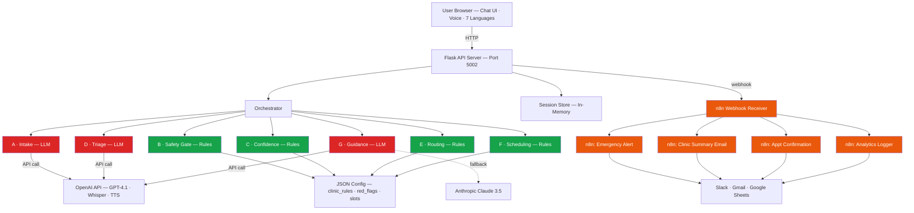
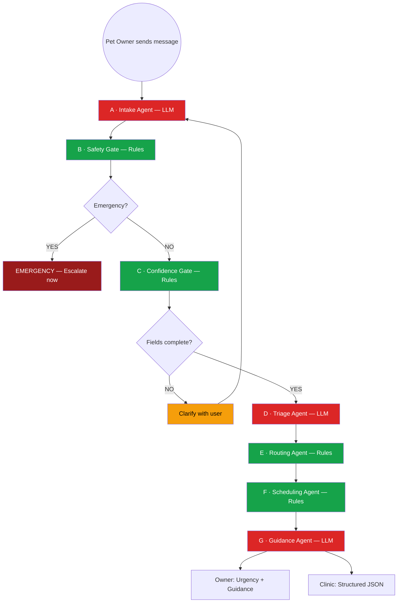
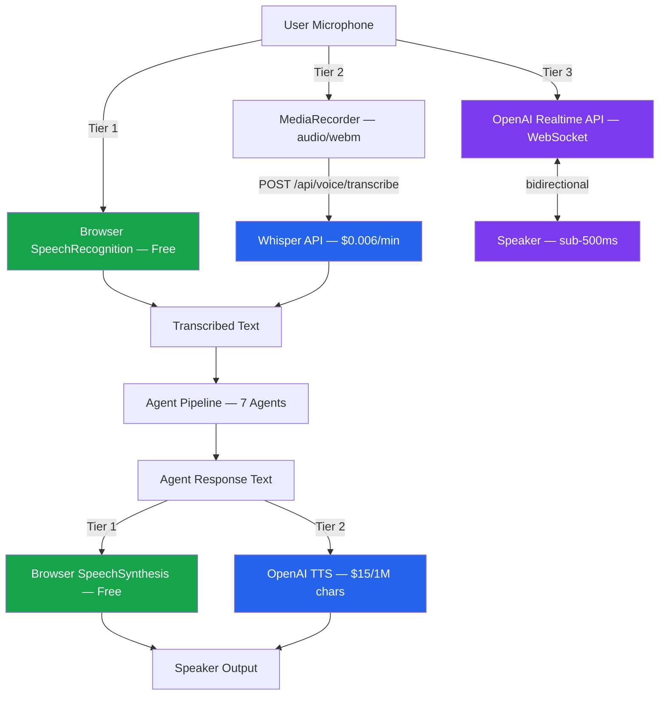

# PetCare Agentic System

**Authors:** Syed Ali Turab & Fergie Feng | **Team:** Broadview | **Date:** March 1, 2026

An AI-powered veterinary triage and smart booking agent that automates pet symptom intake, urgency classification, appointment routing, and provides safe owner guidance — built as part of the MMAI 891 Final Project at Queen's University.

The system reduces front-desk workload and improves clinical routing by automating the end-to-end intake workflow: symptom collection, red-flag detection, triage urgency scoring, appointment booking support, and vet-facing structured summaries, while providing safe, non-diagnostic "do/don't" guidance for pet owners during wait time.

---

## Problem Statement

Veterinary clinics face:

- **High call volumes** — front desk overwhelmed during peak hours
- **Incomplete symptom descriptions** — owners omit critical details
- **Mis-booked appointments** — wrong provider, wrong urgency, wrong slot
- **Repeated clarification calls** — staff calling back to collect missing info
- **Inconsistent triage** — urgency varies by who answers the phone

This system addresses those issues through structured AI-assisted intake and routing with a safety-first, multi-agent architecture.

---

## Architecture

### System Architecture (Full Stack)

**Color key:** Red = LLM-powered agent (API call) · Green = Rule-based agent (zero cost) · Orange = n8n workflow

### Agent Pipeline Flow

### Voice Architecture

**Color key:** Green = Tier 1 (free, browser-native) · Blue = Tier 2 (OpenAI Whisper + TTS) · Purple = Tier 3 (Realtime API, stretch)

---

## System Overview

The PetCare Agent uses a **7-sub-agent architecture** coordinated by a central **Orchestrator Agent**:

| # | Sub-Agent | Type | Responsibility |
|---|-----------|------|----------------|
| A | **Intake Agent** | LLM | Collect pet profile + chief complaint + timeline; ask adaptive follow-ups by symptom area |
| B | **Safety Gate Agent** | Rules | Detect emergency red flags → immediate escalation messaging |
| C | **Confidence Gate Agent** | Rules | Verify required fields and confidence; route to clarification or receptionist review |
| D | **Triage Agent** | LLM | Assign urgency tier (Emergency / Same-day / Soon / Routine) with rationale + confidence |
| E | **Routing Agent** | Rules | Classify symptom category → appointment type / provider pool |
| F | **Scheduling Agent** | Rules | Propose available slots or generate booking request payload |
| G | **Guidance & Summary Agent** | LLM | Generate owner "do/don't" guidance + structured clinic-ready intake summary |

Only 3 of 7 agents make LLM API calls (~$0.01/session). The other 4 run locally as deterministic rules with zero cost and zero latency.

---

## Technology Stack

| Layer | Technology | Cost |
|-------|-----------|------|
| **Frontend** | HTML5 / CSS3 / JavaScript (ES6+) | Free |
| **Backend** | Python 3.11 + Flask | Free |
| **LLM (Primary)** | OpenAI GPT-4.1-mini | ~$0.01/session |
| **LLM (Fallback)** | Anthropic Claude 3.5 Sonnet | ~$0.02/session |
| **Voice STT** | OpenAI Whisper | $0.006/min |
| **Voice TTS** | OpenAI TTS (tts-1) | $15/1M chars |
| **LLM Framework** | LangChain + LangChain-OpenAI | Free |
| **Workflow Automation** | n8n (self-hosted or cloud) | Free |
| **Containerization** | Docker + docker-compose | Free |
| **Hosting** | Render / Railway (free tier) | $0/mo |
| **Languages** | 7 (EN, FR, ZH, AR, ES, HI, UR) | Free |
| **Version Control** | Git + GitHub | Free |

---

## Multilingual Support

The system supports **7 languages** with full UI translation, RTL support, and multilingual voice:

| Language | Direction | Voice (STT/TTS) |
|----------|-----------|-----------------|
| English | LTR | Full |
| French | LTR | Full |
| Chinese (Mandarin) | LTR | Full |
| Arabic | **RTL** | Full |
| Spanish | LTR | Full |
| Hindi | LTR | Full |
| Urdu | **RTL** | Full |

- Arabic and Urdu automatically flip the layout to right-to-left (RTL)
- Voice input and output work in all 7 languages
- Clinic-facing summaries are always generated in English

---

## Voice Support

Three tiers of voice interaction for hands-free intake:

| Tier | Technology | Cost | Latency | Feel |
|------|-----------|------|---------|------|
| **Tier 1** | Browser Web Speech API | Free | ~100ms | Walkie-talkie |
| **Tier 2** | OpenAI Whisper + TTS | ~$0.02/session | ~1-2s | Walkie-talkie |
| **Tier 3** | OpenAI Realtime API | ~$0.50/session | <500ms | Natural phone call |

Voice is an opt-in I/O wrapper — it does not alter agent logic or triage decisions.

---

## Safety-First Design

This system is **not merely a chatbot**. It is a safety-constrained, rule-grounded, modular multi-agent orchestration framework designed for operational veterinary environments.

- **No medical diagnosis generation** — never provides diagnoses or prescriptions
- **Deterministic safety layer** — red-flag detection runs as rules before any AI reasoning
- **Red-flag symptom escalation** — 50+ curated emergency triggers with mandatory escalation
- **Structured confirmation** — critical fields verified before triage proceeds
- **Separation of triage and booking** — urgency classification isolated from scheduling logic
- **Minimal PII storage** — session-only memory, no persistent owner data
- **Conservative defaults** — when uncertain, escalate rather than under-triage

---

## Data Sources

| Source | Type | Used By |
|--------|------|---------|
| [HuggingFace pet-health-symptoms-dataset](https://huggingface.co/datasets/karenwky/pet-health-symptoms-dataset) | 2,000 labeled samples | Intake (A), Triage (D) |
| [ASPCA AnTox / Top Toxins](https://www.aspcapro.org/antox) | 1M+ toxin cases | Safety Gate (B) |
| [Vet-AI Symptom Checker](https://www.vet-ai.com/symptomchecker) | 165 triage algorithms | Triage (D), Routing (E) |
| [SAVSNET / PetBERT](https://github.com/SAVSNET/PetBERT) | 500M+ words, 5.1M records | NLP reference |
| `backend/data/clinic_rules.json` | Synthetic config | Triage (D), Routing (E) |
| `backend/data/red_flags.json` | 50+ emergency triggers | Safety Gate (B) |
| `backend/data/available_slots.json` | Mock schedule | Scheduling (F) |

All POC data is synthetic. No real patient/pet health information (PHI) is used.

---

## MVP Demo Flow

1. Owner describes symptoms via chat (text or voice)
2. **Intake Agent** asks structured follow-up questions
3. **Safety Gate** checks for emergency red flags
4. **Confidence Gate** verifies data completeness
5. **Triage Agent** classifies urgency tier
6. **Routing Agent** selects appointment type + provider pool
7. **Scheduling Agent** proposes available slots
8. **Guidance Agent** generates owner do/don't guidance + clinic summary

---

## Development Phases

| Phase | Focus | Status |
|-------|-------|--------|
| **Phase 1** | Core text-based triage (7 agents + orchestrator) | Done |
| **Phase 2** | Voice support (3 tiers) + multilingual (7 languages) | Done |
| **Phase 3** | Docker containerization + deployment pipeline | Done |
| **Phase 4** | n8n workflow automation (actions layer) | Done |
| **Phase 5** | Evaluation & testing | In Progress |
| **Phase 6** | Report, video & polish | Planned |

---

## Success Metrics (MVP)

| Metric | Target |
|--------|--------|
| Triage tier agreement with clinic staff | ≥ 80% |
| Routing accuracy (correct appointment type) | ≥ 80% |
| Intake completeness (required fields captured) | ≥ 90% |
| Red flag detection rate | 100% |
| Pipeline latency (excl. interactive turns) | < 15s |

---

## Documentation

| Document | Description |
|----------|-------------|
| [docs/architecture.md](docs/architecture.md) | System layers, workflow, design principles, architectural positioning |
| [docs/agent-design.md](docs/agent-design.md) | Agent responsibilities, I/O contracts, data access policy, design decisions |
| [docs/data-model.md](docs/data-model.md) | Data schemas, field specs, access policy, privacy guidance |
| [docs/voice-extension.md](docs/voice-extension.md) | Voice tiers, safety requirements, testing metrics |
| [docs/workflow-use-cases.md](docs/workflow-use-cases.md) | 6 end-to-end test scenarios + validation checklist |
| [docs/repo-structure.md](docs/repo-structure.md) | Repository layout and design rationale |
| [docs/changelog.md](docs/changelog.md) | Project changelog and reading order |

---

## Core Design Principles

- **Decision-first design**: triage and routing support decisions, not diagnoses
- **Safety by default**: red-flag detection with mandatory escalation; never auto-diagnose
- **Explainability**: every triage decision is traceable to symptom evidence
- **Modularity**: agents are independent and single-responsibility
- **Evaluability**: outputs follow a fixed, validated schema
- **Privacy-by-design**: no long-term storage of owner PII; session-only memory

---

## Outputs

The system produces two aligned outputs per intake session:

1. **Owner-Facing Response** — Urgency level + next steps + appointment options + safe do/don't guidance
2. **Clinic-Facing Structured Summary** (JSON) — Pet profile, symptom timeline, triage tier, red flags, category, confidence, notes

---

## Future Extensions

- Insurance pre-authorization agent
- Follow-up care agent
- Vaccination reminder automation
- Telemedicine integration
- Analytics dashboard for clinic operations
- Formal agent orchestration (LangGraph)

---

## Active Development

Implementation code and full deployment setup are on the **`PetCare_Syed`** branch. This `main` branch contains the system design documentation.

---

## License

Educational / MMAI 891 Final Project — Queen's University

---

Built with safety-first agent architecture.
