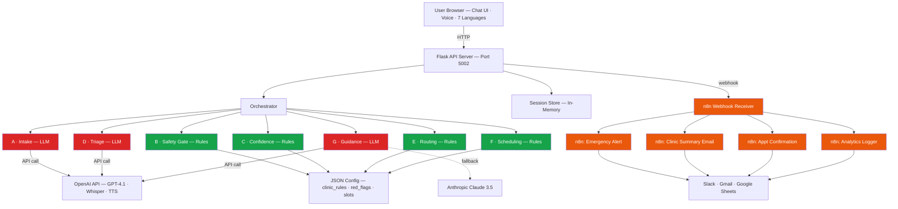
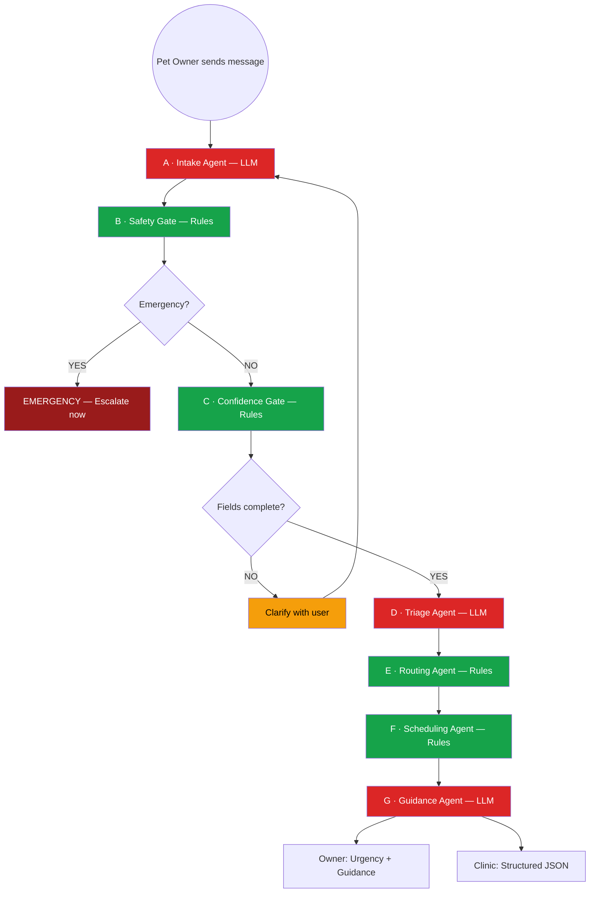
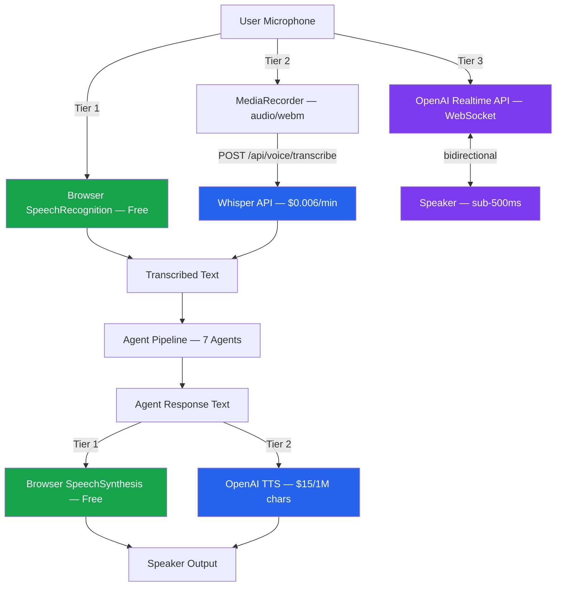
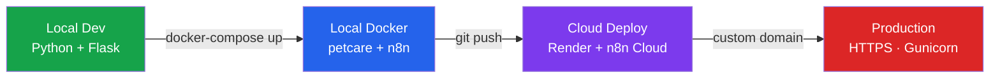

# PetCare Triage & Smart Booking Agent

**Authors:** Syed Ali Turab & Fergie Feng | **Team:** Broadview
**Date:** March 1, 2026

An AI-powered veterinary triage and smart booking agent that automates pet symptom intake, urgency classification, appointment routing, and provides safe owner guidance -- built as part of the MMAI 891 Final Project at Queen's University.

The system reduces front-desk workload and improves clinical routing by automating the end-to-end intake workflow: symptom collection, red-flag detection, triage urgency scoring, appointment booking support, and vet-facing structured summaries, while providing safe, non-diagnostic "do/don't" guidance for pet owners during wait time.

---

## Live Demo

The app is deployed and accessible online:

- **URL:** *(deployment URL -- to be added)*
- **Username:** `petcare`
- **Password:** Reach out to the MMAI 891 team

> First load after inactivity may take ~30-60 seconds (free tier cold start). After that it's instant.

---

## Architecture

### System Architecture (Full Stack)



**Color key:** 🔴 Red = LLM-powered agent (API call) · 🟢 Green = Rule-based agent (zero cost) · 🟠 Orange = n8n workflow

### Agent Pipeline Flow



**Legend:** 🔴 Red = LLM-powered (API call, ~$0.002 each) · 🟢 Green = Rule-based (local, zero cost)

### Voice Architecture



**Color key:** 🟢 Green = Tier 1 (free, browser-native) · 🔵 Blue = Tier 2 (OpenAI Whisper + TTS) · 🟣 Purple = Tier 3 (Realtime API, stretch)

### Technology Stack at a Glance

| Layer | Technology | Cost |
|-------|-----------|------|
| **Frontend** | HTML5 / CSS3 / JavaScript (ES6+) | Free |
| **Backend** | Python 3.11 + Flask | Free |
| **LLM (Primary)** | OpenAI GPT-4.1-mini | ~$0.01/session |
| **LLM (Fallback)** | Anthropic Claude 3.5 Sonnet | ~$0.02/session |
| **Voice STT** | OpenAI Whisper | $0.006/min |
| **Voice TTS** | OpenAI TTS (tts-1) | $15/1M chars |
| **LLM Framework** | LangChain + LangChain-OpenAI | Free |
| **Workflow Automation** | n8n (self-hosted or cloud) | Free |
| **Containerization** | Docker + docker-compose | Free |
| **Hosting** | Render / Railway (free tier) | $0/mo |
| **Languages** | 7 (EN, FR, ZH, AR, ES, HI, UR) | Free |
| **Version Control** | Git + GitHub (`PetCare_Syed` branch) | Free |

See [TECH_STACK.md](TECH_STACK.md) for full details, runtime architecture, and agent deployment model.

### Deployment Roadmap



See [DEPLOYMENT_GUIDE.md](DEPLOYMENT_GUIDE.md) for step-by-step instructions.

---

## Quick Start (Docker -- Recommended)

Requires only [Git](https://git-scm.com/) and [Docker Desktop](https://www.docker.com/products/docker-desktop/).

### macOS / Linux

```bash
git clone https://github.com/FergieFeng/petcare-agentic-system.git
cd petcare-agentic-system
git checkout PetCare_Syed
./start.sh
```

### Windows (PowerShell)

```powershell
git clone https://github.com/FergieFeng/petcare-agentic-system.git
cd petcare-agentic-system
git checkout PetCare_Syed
powershell -ExecutionPolicy Bypass -File start.ps1
```

The script prompts for API keys on first run, pulls latest code, builds the Docker container, and starts the server.
Open [http://localhost:5002](http://localhost:5002) in your browser.

> After someone pushes changes, just run the same script again -- it pulls and rebuilds automatically. Keys are saved locally and never need to be re-entered.

### What the Start Script Does

1. Checks if `.env` exists; if not, prompts for `OPENAI_API_KEY` and `ANTHROPIC_API_KEY`
2. Pulls latest code from the `PetCare_Syed` branch
3. Builds the Docker image (`petcare-agent`)
4. Starts the container, mapping port `5002` and mounting `.env`
5. Opens http://localhost:5002

### Docker Manual Build

```bash
docker build -t petcare-agent .
docker run -p 5002:5002 --env-file .env petcare-agent
```

---

## Quick Start (Local Python)

Requires Python 3.10+ and pip.

```bash
git clone https://github.com/FergieFeng/petcare-agentic-system.git
cd petcare-agentic-system
git checkout PetCare_Syed

# Create virtual environment
python -m venv .venv
source .venv/bin/activate        # macOS/Linux
# .venv\Scripts\activate         # Windows

# Install dependencies
pip install -r requirements.txt

# Configure environment
cp .env.example .env
# Edit .env and add your API keys (at minimum: OPENAI_API_KEY)

# Start the server
cd backend
python api_server.py
```

Open [http://localhost:5002](http://localhost:5002) in your browser.

### Environment Variables

| Variable | Required | Description |
|----------|----------|-------------|
| `OPENAI_API_KEY` | Yes (if using OpenAI) | OpenAI API key for GPT-4.1 |
| `ANTHROPIC_API_KEY` | Yes (if using Anthropic) | Anthropic API key for Claude |
| `DEFAULT_LLM_PROVIDER` | No | `openai` (default) or `anthropic` |
| `DEFAULT_LLM_MODEL` | No | Model name (default: `gpt-4.1-mini`) |
| `PORT` | No | Server port (default: `5002`) |
| `LOG_LEVEL` | No | `DEBUG`, `INFO`, `WARNING`, `ERROR` |
| `N8N_WEBHOOK_URL` | No | n8n webhook URL (auto-set by docker-compose) |

---

## Project Structure

```
├── frontend/                    # Frontend files
│   ├── index.html               # Main HTML (intake chat UI)
│   ├── js/
│   │   └── app.js               # Client-side logic
│   └── styles/
│       └── main.css             # Styles
├── backend/                     # Backend files
│   ├── api_server.py            # Flask API server
│   ├── orchestrator.py          # Orchestrator agent (coordinates sub-agents)
│   ├── agents/                  # Sub-agent implementations
│   │   ├── intake_agent.py      # Sub-Agent A: Adaptive symptom intake
│   │   ├── safety_gate_agent.py # Sub-Agent B: Red-flag detection
│   │   ├── confidence_gate.py   # Sub-Agent C: Field validation + confidence
│   │   ├── triage_agent.py      # Sub-Agent D: Urgency classification
│   │   ├── routing_agent.py     # Sub-Agent E: Symptom → appointment type
│   │   ├── scheduling_agent.py  # Sub-Agent F: Slot proposal / booking
│   │   └── guidance_summary.py  # Sub-Agent G: Owner guidance + vet summary
│   ├── data/                    # Clinic rules, mock schedules, red-flag lists
│   │   ├── clinic_rules.json
│   │   ├── available_slots.json
│   │   └── red_flags.json
│   └── logs/                    # Runtime logs
├── docs/                        # Documentation
│   ├── architecture/            # System-level design docs
│   ├── agent_specs/             # Per-agent design work packages (intake, triage, etc.)
│   └── original_main/           # Preserved docs from main branch (Fergie's design)
├── technical_report.md          # Technical report (assignment deliverable)
├── PROJECT_PLAN.md              # Project plan and timeline
├── Dockerfile                   # Docker containerization (petcare-agent)
├── docker-compose.yml           # Multi-container: petcare-agent + n8n
├── start.sh                     # One-click start (macOS / Linux)
├── start.ps1                    # One-click start (Windows PowerShell)
├── requirements.txt             # Python dependencies
├── .env.example                 # Environment variable template
└── .gitignore
```

---

## System Overview

The PetCare Agent uses a **7-sub-agent architecture** coordinated by a central **Orchestrator Agent**:

| # | Sub-Agent | Responsibility |
|---|-----------|---------------|
| A | **Intake Agent** | Collect pet profile + chief complaint + timeline; ask adaptive follow-ups by symptom area |
| B | **Safety Gate Agent** | Detect emergency red flags → immediate escalation messaging |
| C | **Confidence Gate Agent** | Verify required fields and confidence; route to clarification or receptionist review |
| D | **Triage Agent** | Assign urgency tier (Emergency / Same-day / Soon / Routine) with rationale + confidence |
| E | **Routing Agent** | Classify symptom category → appointment type / provider pool |
| F | **Scheduling Agent** | Propose available slots or generate booking request payload |
| G | **Guidance & Summary Agent** | Generate owner "do/don't" guidance + structured clinic-ready intake summary |

---

## Multilingual Support

The system supports **7 languages** with full UI translation, RTL support, and multilingual voice:

| Language | Flag | Direction | Voice (STT/TTS) |
|----------|------|-----------|-----------------|
| English | 🇬🇧 | LTR | Full |
| French | 🇫🇷 | LTR | Full |
| Chinese (Mandarin) | 🇨🇳 | LTR | Full |
| Arabic | 🇸🇦 | RTL | Full |
| Spanish | 🇪🇸 | LTR | Full |
| Hindi | 🇮🇳 | LTR | Full |
| Urdu | 🇵🇰 | RTL | Full |

- Select language from the dropdown in the header
- The entire UI (buttons, placeholder, disclaimer) switches instantly
- Arabic and Urdu automatically flip the layout to right-to-left (RTL)
- Voice input and output work in all 7 languages
- Clinic-facing summaries are always generated in English
- Language can be changed mid-conversation
- Set language via URL parameter: `?lang=fr`

---

## Voice Support

The system supports **three tiers** of voice interaction for hands-free intake (ideal for pet owners holding a distressed pet):

| Tier | Technology | Cost | How It Works |
|------|-----------|------|-------------|
| **Tier 1** | Browser Web Speech API | Free | Browser captures speech → text → normal pipeline → browser TTS |
| **Tier 2** | OpenAI Whisper + TTS | ~$0.02/session | Audio sent to Whisper API → text → pipeline → OpenAI TTS audio |
| **Tier 3** | OpenAI Realtime API | ~$0.50/session | WebSocket speech-to-speech, sub-500ms latency (stretch goal) |

- Voice is **opt-in**: click the mic button or use the keyboard
- TTS responses can be toggled on/off with the speaker button
- Tier is auto-detected based on browser support and server config
- See [TECH_STACK.md](TECH_STACK.md) for full comparison

---

## Documentation

| Document | Description |
|----------|-------------|
| [TECH_STACK.md](TECH_STACK.md) | Full technology stack, runtime architecture, how agents are deployed |
| [DEPLOYMENT_GUIDE.md](DEPLOYMENT_GUIDE.md) | Step-by-step deployment (local Python, Docker, Render, Railway) |
| [docs/architecture/system_overview.md](docs/architecture/system_overview.md) | Overall architecture and design rationale |
| [docs/architecture/agents.md](docs/architecture/agents.md) | Agent responsibilities, I/O contracts, data access policy, design decisions |
| [docs/architecture/orchestrator.md](docs/architecture/orchestrator.md) | Orchestration logic, rules, and decision ownership |
| [docs/architecture/data_model.md](docs/architecture/data_model.md) | Data schemas, field specs, access policy, privacy guidance |
| [docs/architecture/workflow_technical.md](docs/architecture/workflow_technical.md) | Technical workflow with flowchart, I/O contracts, and examples |
| [docs/architecture/workflow_non_technical.md](docs/architecture/workflow_non_technical.md) | Non-technical workflow overview for general readers |
| [docs/architecture/output_schema.md](docs/architecture/output_schema.md) | Canonical JSON output schema |
| [docs/architecture/repo_structure.md](docs/architecture/repo_structure.md) | Repository layout, directory responsibilities, onboarding guide |
| [docs/architecture/scope_and_roles.md](docs/architecture/scope_and_roles.md) | Project scope, ownership, and collaboration model |
| [docs/test_scenarios.md](docs/test_scenarios.md) | 6 end-to-end test scenarios with validation checklist |
| [docs/CHANGELOG.md](docs/CHANGELOG.md) | Full project changelog and reading order |
| [docs/agent_specs/](docs/agent_specs/) | Per-agent assignable design work packages |
| [PROJECT_PLAN.md](PROJECT_PLAN.md) | Sprint-by-sprint project plan |
| [technical_report.md](technical_report.md) | Technical report (assignment deliverable) |

---

## Core Design Principles

- **Decision-first design**: triage and routing support decisions, not diagnoses
- **Safety by default**: red-flag detection with mandatory escalation; never auto-diagnose
- **Explainability**: every triage decision is traceable to symptom evidence
- **Modularity**: agents are independent and single-responsibility
- **Evaluability**: outputs follow a fixed, validated schema
- **Privacy-by-design**: no long-term storage of owner PII; session-only memory

---

## Outputs

The system produces two aligned outputs per intake session:

1. **Owner-Facing Response**
   - Urgency level + what happens next + appointment confirmation/request + safe do/don't guidance

2. **Clinic-Facing Structured Summary** (JSON)
   - Pet profile, symptom timeline, triage tier + red flags, suggested category, confidence score, notes

See [docs/architecture/output_schema.md](docs/architecture/output_schema.md) for full details.

---

## Success Metrics (MVP)

| Metric | Target |
|--------|--------|
| Triage tier agreement with clinic staff | ≥ 80% |
| Routing accuracy (correct appointment type) | ≥ 80% |
| Intake completeness (required fields captured) | ≥ 90% |
| Receptionist intake time reduction | 30%+ |
| Re-booking / mis-booking reduction | 20%+ |

---

## Data Sources

The PetCare agent draws triage knowledge, symptom data, and red-flag rules from the following sources:

### Symptom & Triage Knowledge

| Source | Type | Usage |
|--------|------|-------|
| [Hugging Face: pet-health-symptoms-dataset](https://huggingface.co/datasets/karenwky/pet-health-symptoms-dataset) | Open dataset (2,000 labeled samples) | Symptom classification training/validation -- covers skin irritations, digestive issues, parasites, ear infections, mobility problems |
| [Vet-AI Symptom Checker](https://www.vet-ai.com/symptomchecker) | Reference | Triage logic patterns -- 165 algorithms built by veterinarians, 4M+ questions processed |
| [SAVSNET / PetBERT](https://github.com/SAVSNET/PetBERT) | NLP model (500M+ words from 5.1M UK vet records) | Reference for veterinary NLP and disease coding patterns |

### Safety & Toxicology

| Source | Type | Usage |
|--------|------|-------|
| [ASPCA Animal Poison Control (AnTox)](https://www.aspcapro.org/antox) | Reference database (1M+ cases) | Red-flag rules for toxin ingestion -- top toxins, species-specific risks |
| [ASPCA Top Toxins 2024](https://www.aspcapro.org/resource/top-10-toxins-2024) | Published list | Prioritized toxin list for Safety Gate agent (OTC meds 16.5%, food/drink 16.1%, chocolate 13.6%, etc.) |
| Veterinary emergency textbooks | Clinical reference | Emergency red-flag definitions (GDV, urinary blockage, dyspnea, seizure, etc.) |

### Clinic Operations (Synthetic / Mock)

| Source | Type | Usage |
|--------|------|-------|
| `backend/data/clinic_rules.json` | Synthetic config | Triage rules, routing maps, provider specialties, species notes |
| `backend/data/red_flags.json` | Curated list (50+ entries) | Emergency red-flag triggers compiled from ASPCA + veterinary emergency guidelines |
| `backend/data/available_slots.json` | Mock data | Simulated clinic schedule for appointment booking POC |

### Data Strategy

- **POC phase:** All data is synthetic or publicly available. No real patient/pet health information (PHI) is used.
- **Future integration:** Clinic scheduling APIs, EMR/CRM systems, real-time appointment availability.
- **Privacy:** Session-only memory. No persistent storage of owner PII. Anonymized logs for evaluation only.

---

## Current Status

> **⚠️ This project has NOT been tested yet.** The code, agents, and endpoints are scaffolded and documented but have not been run or validated end-to-end. Expect breaking issues on first run. Testing and iteration is the immediate next step.

| Area | Status |
|------|--------|
| Architecture & documentation | ✅ Complete |
| Agent implementations (A–G) | ✅ Scaffolded (untested) |
| Orchestrator | ✅ Scaffolded (untested) |
| Flask API server | ✅ Scaffolded (untested) |
| Frontend (chat + voice + multilingual) | ✅ Scaffolded (untested) |
| Docker / docker-compose | ✅ Written (untested) |
| n8n workflows | ✅ Documented (not configured) |
| End-to-end integration testing | ❌ Not started |
| Unit / agent-level testing | ❌ Not started |
| Deployment to cloud (Render/Railway) | ❌ Not started |

---

## Summary

This project demonstrates how a **multi-agent architecture with a central orchestrator** can deliver structured, safe, and explainable decision support for veterinary intake triage and appointment booking, while maintaining clear scope and academic rigor.
