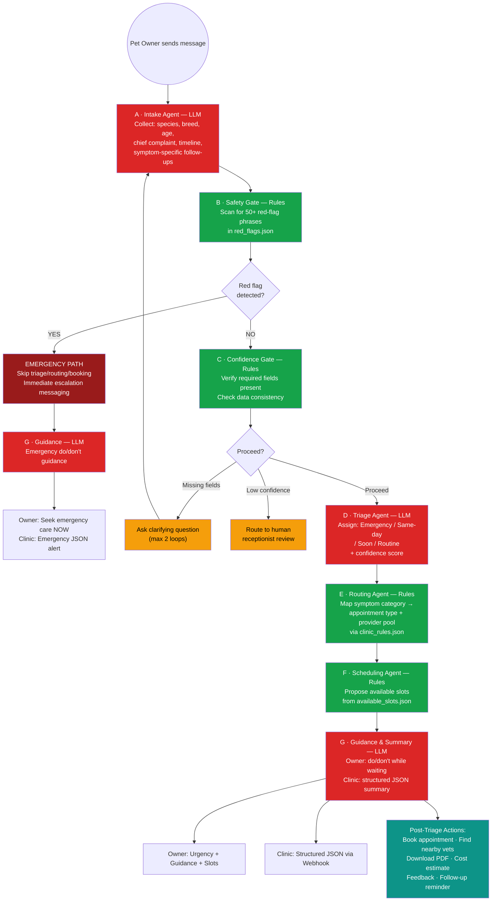
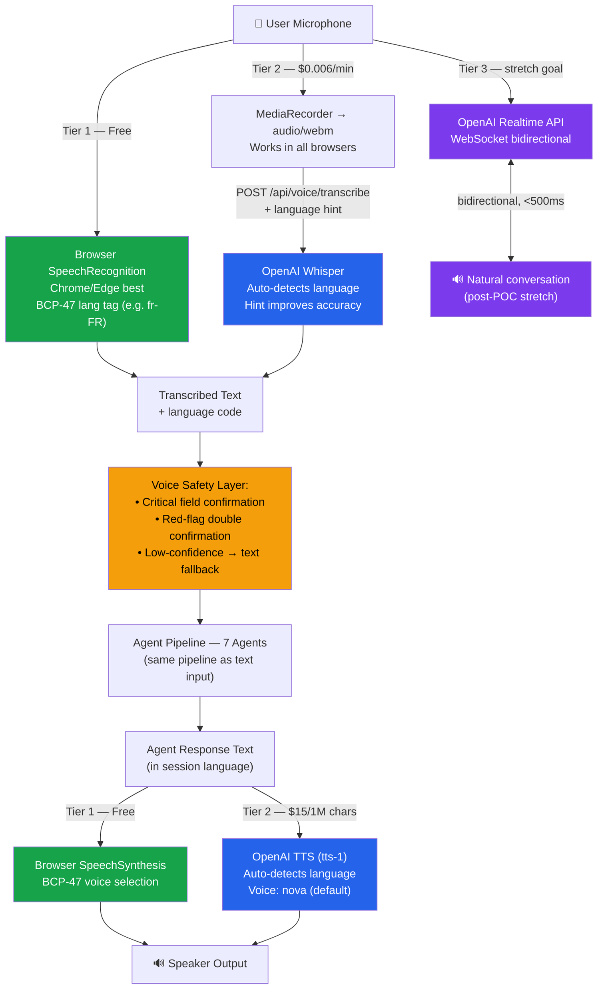

# 🐾 PetCare Agentic System

**Authors:** Syed Ali Turab, Fergie Feng & Diana Liu | **Team:** Broadview  
**Contributors & Reviewers:** Jeremy Burbano, Dumebi Onyeagwu, Ethan He, Umair Mumtaz  
**Date:** March 6, 2026

AI-powered Veterinary Triage & Smart Booking System
A safety-first, multi-agent architecture designed to assist veterinary clinics with structured symptom intake, urgency triage, intelligent routing, and appointment booking — built as part of the MMAI 891 Final Project at Queen's University.

**For pet owners:** Structured intake and clear next steps. **For clinics:** Triage support and structured handoffs — no diagnosis, no bypassing the doctor.

---

## 🚀 Overview

PetCare Agentic System is an AI receptionist framework built to reduce call overload in veterinary clinics by:

- **MVP: text-first** — Structured symptom intake via **chat (text)**; voice is optional/bonus and not required for demo or baseline evaluation (see [BASELINE_METHODOLOGY](docs/BASELINE_METHODOLOGY.md)).
- Collecting structured symptom information via chat (or voice when enabled; 7 languages)
- Safely triaging urgency levels with deterministic red-flag detection
- Routing cases to the correct service line or veterinarian
- Booking appointments intelligently from clinic schedule
- Generating clinic-ready structured summaries (JSON)
- Providing conservative waiting guidance to pet owners
- Triggering post-intake automations via webhook (code-ready; fires if `N8N_WEBHOOK_URL` configured — **not deployed for POC demo**)
- **Finding nearby veterinary clinics** via Google Places API with **OpenStreetMap Overpass fallback** (calling, directions, website)
- **Exporting triage summaries as PDF** for sharing with your vet (professional clinic-ready format)
- **Analyzing symptom photos** via OpenAI Vision API (visual symptom observation)
- **Remembering pet profiles** across sessions (localStorage persistence)
- **Tracking symptom history** for returning users
- **Streaming responses** for a dynamic, ChatGPT-like experience
- **Cost estimator** showing estimated visit costs post-triage
- **Feedback rating** system for quality measurement
- **Follow-up reminders** via browser notifications
- **Breed-specific risk alerts** for known health conditions
- **Dark mode** toggle for accessibility
- **Progressive Web App (PWA)** support for mobile installation
- **Chat transcript export** for sharing full conversations
- **Animated onboarding** walkthrough for first-time users
- **Warm, professional PetCare UI** with teal theme and branded design
- **Comprehensive content-safety guardrails** — deterministic pre-LLM screening with 8 categories: prompt injection / jailbreak, data extraction, violence / weapons, sexual / explicit, human-as-pet, substance abuse, abuse / harassment, and trolling / off-topic. OWASP LLM Top 10 coverage. Leet-speak normalization, multilingual pattern matching (7 languages), pet-medical context exemptions (e.g. "my dog ate rat poison" passes through). 181-case test suite. Plus grief detection, non-pet subject redirect, and normal animal behavior handling.
- **Structured diagnostic follow-up** — asks timeline, eating/drinking, energy level before triage (7 languages)
- **LangSmith observability** — tracing for all LLM calls and orchestrator pipeline (**live on Render**)
- **Twilio click-to-call** — call clinics directly from vet finder via Twilio (code-ready; not deployed for POC demo)

The system is designed with **layered responsibility separation**, **safety constraints**, and **extensibility** in mind.

---

## 🎯 Problem Statement

Veterinary clinics often face:

- **High call volumes** — front desk overwhelmed during peak hours
- **Incomplete symptom descriptions** — owners omit critical details
- **Mis-booked appointments** — wrong provider, wrong urgency, wrong slot
- **Repeated clarification calls** — staff calling back to collect missing info
- **Inconsistent triage** — urgency varies by who answers the phone

This system addresses those issues through structured AI-assisted intake and routing with a multi-agent architecture.

---

## 📖 The Pivot Story — How This System Evolved

> **Version `v1.0-owner-portal` → `feature/clinic-triage-pivot`**

We started by building a conversational chatbot for pet owners — natural language intake, asking for your pet's name and breed, finding nearby vets. The owner-facing experience worked well (23/23 tests passing). But we noticed something: our backend was never really a consumer chatbot. Every agent in the pipeline was a clinical tool.

The Safety Gate runs deterministic logic from ASPCA toxicology guidelines. The Triage Agent classifies urgency using veterinary-grade tier definitions. The Routing Agent uses a clinic-defined rulebook. The Guidance Agent generates structured JSON for veterinarians. The "chatbot" was just the intake layer on top of clinical decision-support infrastructure.

At the same time, we had a data problem: we had illness-focused symptom knowledge, but the consumer framing kept pushing toward general pet Q&A. That's where hallucinations creep in — the LLM is asked to reason about things it has no grounded data for.

**The insight:** Scope the product to match the data and the pipeline. We already had a clinic triage tool. We needed to name it correctly — and ground its decisions in real illness knowledge.

### What the pivot adds

| | v1.0 owner portal | v1.1 clinic triage tool |
|--|-------------------|-----------------------------|
| **Triage grounding** | LLM general knowledge | LLM + RAG illness knowledge base |
| **Illness KB** | None | 24 conditions from ASPCA/AVMA/Cornell guidelines |
| **TC-04 (urinary block)** | ❌ Under-triaged as Same-day | ✅ RAG surfaces Emergency reference |
| **Scope** | Open-ended Q&A | Illness symptom intake only |

The v1.0 codebase is preserved at tag `v1.0-owner-portal`. The pivot branch is `feature/clinic-triage-pivot`. The full story is documented in `finalreport.md` Section 7 and `docs/AGENT_DESIGN_CANVAS.md` Step 10.

---

## 👥 Who It's For (Two Products, One System)

PetCare serves **two audiences** with **one pipeline**: pet owners get a clear intake experience and guidance; clinics get structured triage and handoffs so staff can act quickly. Think of it as two products in how we position value — owners and clinics — powered by the same backend.

### For pet owners

| Aspect | Description |
|--------|-------------|
| **Product** | Structured symptom intake & triage |
| **What you get** | Describe your pet's issue in chat (text or optional voice) → get a **suggested** "how soon to be seen" (Emergency / Same-day / Soon / Routine), **contextual "do/don't while waiting" guidance** (tailored to symptom type from templates; we don't name diseases), and optional **appointment slot options** — without long hold times or repeating yourself. The **final** decision on when to be seen is the **clinic's** (receptionist or doctor); we only suggest based on intake. The system does **not** name conditions or diseases. The AI adds value by **structured intake**, **adaptive follow-ups**, **symptom-dependent suggested triage**, and **symptom-type-specific guidance**. |
| **Safety** | **Not diagnosis.** We never say *what is wrong*. We only suggest *when* to be seen and give general waiting-room advice; the **clinic (receptionist/doctor) makes the real call**. No prescription. When in doubt, we tell you to **seek care** or **talk to the clinic**. Red flags trigger immediate escalation messaging. |

### For clinics

| Aspect | Description |
|--------|-------------|
| **Product** | Intake & triage support for front desk and clinical staff |
| **What you get** | **Fewer incomplete calls**, **consistent intake**, and **structured JSON summaries** with a **suggested** urgency tier and routing so reception and vets can act quickly. The system **suggests** Emergency / Same-day / Soon / Routine for routing; the **receptionist and doctor make the final decision** — receptionist still involves the doctor when needed, same as today. Red-flag detection and handoff to staff when the system isn't confident. |
| **Safety** | The AI **supports** intake and suggests triage; **medical and scheduling decisions stay with receptionists, nurses, and doctors**. The system never diagnoses, prescribes, or bypasses the doctor. Receptionist asks the doctor when in doubt; we don't replace that. Low-confidence or conflicting info routes to human receptionist review. |

One system, two value propositions: better experience for owners, better workflow for clinics.

**Two outputs, one pipeline:**

| Audience | Interface | Output | POC Status |
|----------|-----------|--------|------------|
| **Pet owner** | Chat interface (web) | Conversational response: urgency, guidance, cost estimate, slot options. | ✅ Fully functional on Render |
| **Clinic** | Summary panel in chat UI + JSON API | Structured JSON summary (urgency, routing, rationale, pet profile, all agent outputs). | ✅ JSON generated and viewable |
| **Clinic (automation)** | Webhook POST | Same JSON delivered to Slack, email, or any endpoint. | ⚠️ Code exists; **no receiving endpoint configured for POC demo** |

> **POC scope note:** The pet owner side is fully functional. The clinic side produces the structured JSON that would power all clinic workflows. The webhook code exists and fires if `N8N_WEBHOOK_URL` is set, but no receiving automation (n8n, Slack, email) is deployed for the POC demo. This is appropriate for a POC demonstrating the multi-agent pipeline.

**Override and verification (production requirement — not built in POC):**

- **Staff/doctor override:** In production, the clinic must be able to **override** the AI's suggested urgency. The system suggests; staff/doctor decide.
- **Verification before owner notification:** The suggested triage must be **verified** by staff/doctor **before** the final response is sent to the pet owner.
- **Emergency = additional charge:** Override prevents inappropriate emergency labeling and unnecessary cost.

**POC vs. Production — clinic workflow:**

| Phase | What's built | Owner | Clinic |
|-------|-------------|-------|--------|
| **POC (current)** | 7-agent pipeline deployed on Render. Owner chat fully functional. Clinic JSON generated. | Sees suggested urgency + guidance + cost + slots immediately. | JSON available via API and in-chat clinic panel. Webhook code exists but no receiving endpoint configured for demo. |
| **Production (intended)** | Same pipeline + webhook delivery + clinic verification step. | Staff verify before owner notification. | Receives JSON in Slack/email, staff override urgency, approve, then owner notified. |

**Build order (from POC to production):**

1. **Done (POC):** 7-agent pipeline deployed on Render. Owner chat fully functional. Clinic JSON generated and viewable via API and UI panel.
2. **Next (post-POC):** Configure webhook endpoint (n8n, Slack, or email) so clinic staff receive JSON automatically.
3. **Later (production):** Add clinic verification step, staff override UI, real booking API integration (Vet360, PetDesk).


---

## 🧠 System Architecture

### System Architecture (Full Stack)

```mermaid
graph TD
    BROWSER["User Browser — Chat UI · Voice · Photo · 7 Languages"]

    BROWSER -->|HTTP / HTTPS| AUTH["HTTP Basic Auth Middleware"]
    AUTH --> FLASK["Flask API Server — Port 5002 — Gunicorn"]
    FLASK --> ORCH["Orchestrator"]
    FLASK --> SESSION["Session Store — Two-Tier In-Memory"]

    SESSION --> ACTIVE["Active Sessions — 1 hr TTL"]
    SESSION --> COMPLETED["Completed Sessions — 24 hr TTL"]

    ORCH --> A["A · Intake Agent — LLM"]
    ORCH --> B["B · Safety Gate Agent — Rules"]
    ORCH --> CC["C · Confidence Gate — Rules"]
    ORCH --> D["D · Triage Agent — LLM"]
    ORCH --> E["E · Routing Agent — Rules"]
    ORCH --> FF["F · Scheduling Agent — Rules"]
    ORCH --> GA["G · Guidance & Summary — LLM"]

    A -->|API call| OPENAI["OpenAI API — GPT-4o-mini"]
    D -->|API call| OPENAI
    GA -->|API call| OPENAI

    FLASK -->|/api/voice/transcribe| WHISPER["OpenAI Whisper — STT"]
    FLASK -->|/api/voice/synthesize| TTS["OpenAI TTS — Speech"]
    FLASK -->|/api/photo/analyze| VISION["OpenAI Vision — Photo Analysis"]

    B --> DATA["JSON Config — clinic_rules · red_flags · slots"]
    CC --> DATA
    E --> DATA
    FF --> DATA

    FLASK -.->|"webhook POST (code-ready)"| WH["Webhook — configurable endpoint"]
    WH -.-> SVC["Email · Slack · Automation (not deployed for POC)"]

    FLASK -->|Dockerfile| RENDER["Render — Cloud Deployment"]

    FLASK -->|Google Places API| GMAPS["Nearby Vet Finder — call · directions"]
    FLASK -->|OSM Overpass fallback| OVERPASS["OpenStreetMap Overpass — no API key needed"]
    BROWSER -->|Nominatim geocoding| NOMINATIM["OpenStreetMap — city/postal lookup"]
    FLASK -->|/api/session/id/summary| PDF["PDF Export — fpdf2"]
    BROWSER --> GEO["Browser Geolocation"]
    BROWSER --> LS["localStorage — Pet Profile · History · Consent"]
    BROWSER --> NOTIF["Browser Notifications — Reminders"]
    BROWSER --> SW["Service Worker — PWA"]

    style A fill:#dc2626,color:#fff
    style D fill:#dc2626,color:#fff
    style GA fill:#dc2626,color:#fff
    style B fill:#16a34a,color:#fff
    style CC fill:#16a34a,color:#fff
    style E fill:#16a34a,color:#fff
    style FF fill:#16a34a,color:#fff
    style AUTH fill:#f59e0b,color:#000
    style WH fill:#94a3b8,color:#fff
    style RENDER fill:#7c3aed,color:#fff
    style GMAPS fill:#ea4335,color:#fff
    style OVERPASS fill:#ea4335,color:#fff
    style NOMINATIM fill:#ea4335,color:#fff
    style VISION fill:#dc2626,color:#fff
    style WHISPER fill:#2563eb,color:#fff
    style TTS fill:#2563eb,color:#fff
    style PDF fill:#64748b,color:#fff
    style GEO fill:#16a34a,color:#fff
    style LS fill:#16a34a,color:#fff
    style NOTIF fill:#16a34a,color:#fff
    style SW fill:#16a34a,color:#fff
    style ACTIVE fill:#0d9488,color:#fff
    style COMPLETED fill:#0d9488,color:#fff
```



**Color key:** 🔴 Red = LLM/API-powered · 🟢 Green = Client-side (free) · 🔵 Blue = OpenAI voice APIs · 🟠 Orange = Auth middleware · 🟣 Purple = Cloud deployment · ⬜ Gray dashed = Code-ready but not deployed for POC

---

### 🔄 Agent Pipeline Flow



**Legend:** 🔴 Red = LLM-powered (API call, ~$0.002 each) · 🟢 Green = Rule-based (local, zero cost) · 🟠 Yellow = Human loop · 🟢 Teal = Post-triage features

---

### 🎤 Voice Architecture



**Color key:** 🟢 Green = Tier 1 (free, browser-native) · 🔵 Blue = Tier 2 (OpenAI Whisper + TTS) · 🟣 Purple = Tier 3 (Realtime API, stretch) · 🟠 Yellow = Safety layer

---

## 🤖 Core Multi-Agent Layer

The PetCare Agent uses a **7-sub-agent architecture** coordinated by a central **Orchestrator Agent**. All agents run **in-process** within the same Flask server (no microservices, no network calls between agents):

| # | Agent | Type | Input | Output | Responsibility |
|---|-------|------|-------|--------|---------------|
| A | **Intake Agent** | 🔴 LLM | User message + conversation history | Pet profile, chief complaint, follow-up question | Collect species, breed, age, weight, chief complaint, timeline; ask adaptive follow-ups by symptom area (GI, respiratory, derm, injury, urinary, neuro, behavioral). Supports any animal species (dogs, cats, birds, reptiles, fish, horses, exotic). |
| -- | **Pre-Intake Guardrails** | 🟢 Rules | Raw user message | Block / pass decision | **Comprehensive content-safety screen** (`backend/guardrails.py`): 8 categories — prompt injection / jailbreak (OWASP LLM01, LLM07), data extraction (OWASP LLM02), violence / weapons / terrorism / self-harm / animal cruelty, sexual / explicit / bestiality, human-as-pet, substance abuse (pet context), abuse / harassment / slurs, trolling / off-topic. Leet-speak normalization, multilingual patterns (FR, ES, ZH, AR, HI, UR), pet-medical context exemptions. Runs **before** any LLM call. Plus: deceased pet (compassionate close), non-pet subject redirect, normal animal behavior handling. **v1.1: non-illness scope redirect** (`_NON_ILLNESS_PATTERNS` in orchestrator) — general pet Q&A (food/diet, training, grooming, breed info, pricing, registration) redirected with warm message when no medical symptom words present. 181-case test suite. |
| B | **Safety Gate Agent** | 🟢 Rules | Extracted symptoms from Intake | Red-flag status, matched keywords | Scan for 50+ emergency trigger phrases from `red_flags.json` (difficulty breathing, seizures, collapse, suspected toxin, inability to urinate, uncontrolled bleeding). Triggers immediate escalation — bypasses triage/routing/booking. |
| C | **Confidence Gate Agent** | 🟢 Rules | Pet profile fields, symptom data | Proceed / clarify / human-review decision | Verify required fields (species, chief complaint, duration) are present and consistent. If missing → loop back to Intake (max 2x). If conflicting → route to human receptionist review. |
| D | **Triage Agent** | 🔴 LLM + RAG | Complete pet profile + symptoms | Urgency tier, confidence score, rationale | Assign urgency: **Emergency** (life-threatening, within hours), **Same-day** (needs attention today), **Soon** (within 1-3 days), **Routine** (next available). Returns rationale and 0-1 confidence score. **v1.1:** Before the LLM call, `rag_retriever.py` scores the complaint against `pet_illness_kb.json` (24 entries, keyword-overlap, species bonus) and injects the top-3 results as a clinical reference block — grounding the LLM with evidence-based urgency escalators and red flags from ASPCA/AVMA/Cornell. |
| E | **Routing Agent** | 🟢 Rules | Symptom category from Triage | Appointment type, provider pool | Map symptom category to appointment type and provider pool using `clinic_rules.json`. Species-specific routing (cat vs dog vs exotic → different providers). |
| F | **Scheduling Agent** | 🟢 Rules | Appointment type, urgency tier | Proposed time slots | Query `available_slots.json` for slots matching urgency window. Emergency → earliest available; Routine → next regular slot. |
| G | **Guidance & Summary** | 🔴 LLM | Full session data (all agent outputs) | Owner guidance + clinic JSON | Generate species-correct "do/don't while waiting" + escalation cues (owner-facing, in session language). Generate structured clinic-ready JSON summary (always English). |

**Execution model:** Sequential within a single HTTP request. Only 3 of 7 agents make LLM API calls (~$0.01/session). The other 4 run locally as deterministic rules with zero cost and zero latency.

**Data permissions:** Agents operate under role-based data access. Triage cannot modify the pet profile. Safety Gate runs before Triage to prevent any downstream reasoning on emergency cases. Scheduling cannot override triage urgency. See [docs/architecture/agents.md](docs/architecture/agents.md) for full I/O contracts and data access policy.

---

## 🗄 Data Layer

| Data Store | Purpose | Used By |
|-----------|---------|---------|
| `backend/data/clinic_rules.json` | Triage rules, routing maps, provider specialties | Triage (D), Routing (E) |
| `backend/data/red_flags.json` | 50+ emergency trigger phrases | Safety Gate (B) |
| `backend/data/available_slots.json` | Mock clinic schedule (30-min slots) | Scheduling (F) |
| `backend/data/pet_illness_kb.json` | 24-entry illness KB for RAG-grounded triage (ASPCA/AVMA/Cornell/VCA) — v1.1 | Triage (D) via `rag_retriever.py` |
| In-memory session | Active intake records, appointments | All agents via Orchestrator |

See [docs/architecture/data_model.md](docs/architecture/data_model.md) for full schemas.

---

## 🛡 Safety-First Design Principles

> Core innovation lies in safety-grounded triage and structured routing — not just conversational AI.

This system is **not merely a chatbot**. It is a safety-constrained, rule-grounded, modular multi-agent orchestration framework.

- **No medical diagnosis generation** — never provides diagnoses or prescriptions
- **Deterministic safety layer** — red-flag detection runs as rules before any AI reasoning
- **Rule-grounded urgency classification** — triage maps to clinic-approved rules
- **Red-flag symptom escalation** — 50+ curated emergency triggers with mandatory escalation
- **Structured confirmation** — critical fields verified by Confidence Gate before triage
- **Separation between triage and booking** — urgency classification isolated from scheduling
- **Minimal PII storage** — session-only memory, no persistent owner data
- **Conservative defaults** — when uncertain, escalate rather than under-triage

---

## 🎤 Voice Support

Three tiers of voice interaction for hands-free intake (ideal for pet owners holding a distressed pet):

| Tier | Technology | Cost | Latency | Feel |
|------|-----------|------|---------|------|
| **Tier 1** | Browser Web Speech API | Free | ~100ms | Walkie-talkie |
| **Tier 2** | OpenAI Whisper + TTS | ~$0.02/session | ~1-2s | Walkie-talkie |
| **Tier 3** | OpenAI Realtime API | ~$0.50/session | <500ms | Natural phone call |

Voice is an **opt-in I/O wrapper** — it does NOT alter business logic or agent decisions.

Voice mode requires:
- Critical symptom confirmation via voice
- Noise-handling fallback (text if low confidence)
- Red-flag double confirmation before escalation

See [TECH_STACK.md](TECH_STACK.md) for full voice safety requirements and testing metrics.

---

## 🌐 Multilingual Support

The system supports **7 languages** with full UI translation, RTL support, and multilingual voice:

| Language | Flag | Direction | Voice (STT/TTS) |
|----------|------|-----------|-----------------|
| English | 🇬🇧 | LTR | Full |
| French | 🇫🇷 | LTR | Full |
| Chinese (Mandarin) | 🇨🇳 | LTR | Full |
| Arabic | 🇸🇦 | **RTL** | Full |
| Spanish | 🇪🇸 | LTR | Full |
| Hindi | 🇮🇳 | LTR | Full |
| Urdu | 🇵🇰 | **RTL** | Full |

- Arabic and Urdu automatically flip the layout to right-to-left (RTL)
- Clinic-facing summaries are always generated in English
- Language can be changed mid-conversation
- Set language via URL parameter: `?lang=fr`

---

## 🏷 Technology Stack

| Layer | Technology | Cost |
|-------|-----------|------|
| **Frontend** | HTML5 / CSS3 / JavaScript (ES6+) + Inter font | Free |
| **UI Design** | Warm teal theme, gradient header, paw avatars, PWA-ready | Free |
| **Backend** | Python 3.11 + Flask | Free |
| **LLM (Primary)** | OpenAI GPT-4o-mini | ~$0.01/session |

| **Voice STT** | OpenAI Whisper | $0.006/min |
| **Voice TTS** | OpenAI TTS (tts-1) | $15/1M chars |
| **Photo Analysis** | OpenAI Vision (GPT-4o-mini) | ~$0.002/photo |
| **Nearby Vets** | Google Places API + OpenStreetMap Overpass (fallback) | Free (OSM fallback requires no API key) |
| **PDF Export** | fpdf2 (server-side) | Free |
| **Pet Profile & History** | Browser localStorage | Free |

| **Webhook Automation** | Configurable webhook POST (code-ready; not deployed for POC demo) | Free |
| **Containerization** | Docker + docker-compose | Free |
| **Hosting** | **Render (recommended)** / Railway (free tier) | $0/mo — Render recommended for POC (GitHub auto-deploy, HTTPS). |
| **Languages** | 7 (EN, FR, ZH, AR, ES, HI, UR) | Free |
| **Version Control** | Git + GitHub (`main` branch) | Free |

See [TECH_STACK.md](TECH_STACK.md) for full details, runtime architecture, and agent deployment model.

---

## 📊 Data Sources

### Operational data (used at runtime)

The POC uses only these data files. All are synthetic; no real patient/pet health information (PHI) is used.

| Source | Type | Used by |
|--------|------|---------|
| `backend/data/clinic_rules.json` | Synthetic config | Routing (E): triage rules, routing maps, provider list |
| `backend/data/red_flags.json` | Curated list (50+ entries) | Safety Gate (B): emergency triggers |
| `backend/data/available_slots.json` | Mock data | Scheduling (F): appointment booking POC |
| `backend/data/pet_illness_kb.json` | Curated KB — 24 entries (ASPCA/AVMA/Cornell/VCA) | Triage (D) via `rag_retriever.py`: RAG-grounded urgency classification (v1.1) |

### Design references (not used at runtime)

The following were consulted for domain context and workflow design only. They are **not** loaded or called by the system.

| Source | Type | How we used it |
|--------|------|----------------|
| [HuggingFace: pet-health-symptoms-dataset](https://huggingface.co/datasets/karenwky/pet-health-symptoms-dataset) | Open dataset (2,000 samples) | Symptom taxonomy / category ideas |
| [Vet-AI Symptom Checker](https://www.vet-ai.com/symptomchecker) | Commercial product | Triage workflow design inspiration |
| [SAVSNET / PetBERT](https://github.com/SAVSNET/PetBERT) | Veterinary NLP reference | General NLP / coding patterns |
| [ASPCA Animal Poison Control](https://www.aspcapro.org/antox) | 1M+ cases | Ideas for red-flag phrasing in `red_flags.json` |
| Veterinary emergency textbooks | Clinical reference | Emergency red-flag definitions (curated into `red_flags.json`) |

---

## 🧪 MVP Demo Flow

**What happens live in the POC demo (all steps run on Render):**

1. Owner visits the live site → sees onboarding walkthrough → accepts consent banner
2. Owner describes symptoms via **chat** (text, voice, or photo — any of 7 languages)
3. **Intake Agent** (LLM) asks structured follow-up questions (species, symptoms, timeline, etc.)
4. **Safety Gate** (rules) checks for 50+ emergency red-flag phrases
5. **Confidence Gate** (rules) verifies data completeness — loops back if fields missing
6. **Triage Agent** (LLM) classifies urgency: Emergency / Same-day / Soon / Routine
7. **Routing Agent** (rules) selects appointment type + provider pool from clinic rules
8. **Scheduling Agent** (rules) proposes available slots from mock schedule
9. **Guidance Agent** (LLM) generates "do/don't while waiting" guidance + clinic JSON summary
10. Owner sees: **urgency**, **guidance**, **cost estimate**, **appointment slots** — all in their chosen language
11. Post-triage actions available: **Find nearby vets** (with call/directions), **Download PDF summary**, **Download chat transcript**, **Book appointment**, **Give feedback** (1-5 stars), **Set reminder**
12. Clinic summary panel displays structured JSON (species, urgency, rationale, routing, factors)

**What is NOT deployed for the POC demo:**

- **Webhook / n8n automation:** The webhook code exists in `api_server.py` and will fire a POST to any URL set in `N8N_WEBHOOK_URL`, but no receiving endpoint (n8n, Slack, email) is configured for the POC. In production, this would deliver the clinic JSON to the clinic's chosen channel.
- **Clinic verification/override step:** Not built. In production, staff would review the AI's suggested triage, optionally override the urgency tier, and approve before the owner receives a final confirmed response.
- **Clinic dashboard / queue:** Not built. In production, this would be a simple UI where staff see incoming cases, override urgency, and click "Approve."
- **Real clinic booking API:** The POC books against a mock `available_slots.json`. Production would integrate with a real clinic scheduling system (Vet360, PetDesk, etc.).

---

## ✅ Current Status

> **Post-v1.0 improvement branches merged (March 8, 2026):** scheduling urgency-window filtering, multilingual slot confirmation, `SessionState` constants, and frontend UX hardening (auto-grow textarea, character counter, dark-mode emergency banner fix, `AbortController`, i18n strings, aria-labels). See [docs/CHANGELOG.md](docs/CHANGELOG.md) for full details.

> **v1.1-poc — POC 1.1 enhancements merged to main.** Builds on the baseline v1.0-poc (100% M2/M4 eval). POC 1.1 adds smart guardrails, structured diagnostic intake, booking fixes, full i18n enforcement, LangSmith observability, N8N webhook integration, Twilio click-to-call, and scroll UX improvements. Live URL: `https://petcare-agentic-system.onrender.com` (password-protected).

### Post-v1.0 Improvements (March 8, 2026)

| Branch | Change |
|--------|--------|
| `improve/scheduling-urgency-window` | Scheduling Agent pre-filters slots by urgency date window (Same-day → today, Soon → 1–3 days, Routine → 7 days); falls back to full pool if window is empty |
| `improve/slot-confirmation` | `_match_slot()` recognises ordinal words ("first"/"premier"/"第一个"/"الأول"/"पहला"/"پہلا") and day names in all 7 languages via new `_DAY_NAMES` dict — previously English only |
| `improve/session-state-enum` | `SessionState` class added to `orchestrator.py` with constants `INTAKE`, `COMPLETE`, `EMERGENCY`, `BOOKED`, `TERMINAL_STATES` — all raw-string state checks replaced; dead code removed from `intake_agent.py` |
| `improve/frontend-ux` | Auto-grow textarea, live character counter (amber/red at 80%/100%), dark-mode emergency banner fix, `AbortController` for `/message` fetch, `sessionExpired`/`getStarted`/`charCount` i18n keys in all 7 languages, `aria-label` on all icon-only buttons |

### What's New in POC 1.1

| Feature | Description |
|---------|-------------|
| **Smart Intake Guardrails** | Pre-LLM deterministic screening: abuse/threats (firm boundary), deceased pet (compassionate + grief resources), non-pet subjects ("my human isn't well" → redirect), normal animal behavior ("humping" → acknowledge). All localized in 7 languages. |
| **Structured Diagnostic Follow-up** | After species + chief complaint, asks timeline → eating/drinking → energy level (one per turn, max 3). Provides richer context to triage. Localized in 7 languages. |
| **Booking Confirmation Fix** | Natural slot matching with score-based system (day name, month, time, provider). "Tuesday March 10th 11am with Dr. Patel" now books correctly without requiring "book" keyword. |
| **Full Language Enforcement** | All orchestrator messages, intake fallbacks, emergency alerts, restart/booking keywords localized in 7 languages via `_UI_STRINGS`, `_GUARDRAIL_STRINGS`, and `_t()` helper. |
| **LangSmith Observability** | `wrap_openai` on all 3 LLM agents + `@traceable` on orchestrator. **Live on Render** (env vars configured). |
| **N8N Webhook Integration** | Fires POST on terminal states (complete/emergency/booked) with full session payload. Code-ready; fires if `N8N_WEBHOOK_URL` set — **not deployed for POC demo**. |
| **Twilio Click-to-Call** | Backend `/api/call` endpoint + frontend "Call via app" button on vet cards. Code-ready; activates if Twilio env vars set — **not deployed for POC demo**. |
| **Scroll Bug Fix** | Centralized `_scrollToBottom()` helper with instant mode during typing animation. Eliminates CSS smooth-scroll conflicts. |

### Pet Owner Side (fully functional in POC)

| Feature | Status | Notes |
|---------|--------|-------|
| 7-agent pipeline (Intake → Safety → Confidence → Triage → Routing → Scheduling → Guidance) | ✅ Live on Render | Full end-to-end flow working |
| Chat UI (text input + streaming responses) | ✅ Live on Render | Character-by-character streaming, warm teal theme |
| Voice input/output (Tier 1: browser + Tier 2: OpenAI Whisper/TTS) | ✅ Live on Render | Tier 3 Realtime API is post-POC stretch |
| Multilingual support (7 languages, RTL for Arabic/Urdu) | ✅ Live on Render | All UI strings + LLM output in selected language |
| Photo symptom analysis (OpenAI Vision) | ✅ Live on Render | Upload photo → AI visual observation |
| Nearby vet finder (Google Places + OpenStreetMap fallback) | ✅ Live on Render | OSM Overpass fallback if Google API unavailable; call/directions/website |
| PDF triage summary export | ✅ Live on Render | Clinic-ready format, 24hr persistence |
| Chat transcript export | ✅ Live on Render | Full conversation download as .txt |
| Pet profile persistence | ✅ Live on Render | localStorage — remembered across sessions |
| Symptom history tracker | ✅ Live on Render | localStorage — past triages viewable |
| Post-triage appointment booking | ✅ Live on Render | Simulated booking from `available_slots.json` |
| Cost estimator | ✅ Live on Render | Estimated visit cost shown post-triage |
| Feedback rating (1–5 stars) | ✅ Live on Render | Quality measurement data |
| Follow-up reminders | ✅ Live on Render | Browser notifications |
| Breed-specific risk alerts | ✅ Live on Render | Known health conditions surfaced |
| Consent & privacy banner (PIPEDA/PHIPA) | ✅ Live on Render | Shown on first visit |
| Dark mode | ✅ Live on Render | Toggle in header |
| PWA support | ✅ Live on Render | Installable on mobile |
| Animated onboarding | ✅ Live on Render | 3-step walkthrough for first-time users |

### Clinic Side (POC scope — see note below)

| Feature | Status | Notes |
|---------|--------|-------|
| Structured JSON summary (all agent outputs) | ✅ Live on Render | Accessible via `GET /api/session/<id>/summary`; displayed in clinic panel after triage |
| Webhook code (POST to configurable endpoint) | ⚠️ Code-ready, **not deployed** | Fires only if `N8N_WEBHOOK_URL` env var is set — no n8n/Slack/email endpoint is configured for POC demo |
| Clinic verification/override step | 📋 Production-only | Not built — requires clinic dashboard; documented as intended production workflow |
| Clinic dashboard / queue | 📋 Production-only | Not built — would allow staff to review, override urgency, approve before owner notification |

> **Note on clinic side:** The POC focuses on the **pet owner experience** and the **agent pipeline**. The clinic receives a structured JSON summary (viewable in the UI panel and via API), which is the data payload that would power clinic workflows in production. The webhook endpoint exists in code and will fire a POST request if `N8N_WEBHOOK_URL` is configured, but **no receiving automation (n8n, Slack, email) is deployed for the POC demo**. In production, this webhook would deliver the JSON to the clinic's chosen channel, and a verification step would be added before the owner receives a final confirmed response.

### Infrastructure & Security

| Feature | Status | Notes |
|---------|--------|-------|
| Docker + Gunicorn (single-worker + threads) | ✅ Live on Render | Dockerfile tested and deployed |
| HTTP Basic Auth (password protection) | ✅ Live on Render | Credentials via env vars only, never hardcoded. Applied to all `/api/*` routes post-pentest (VULN-01/02 fix). |
| Rate limiting (flask-limiter) | ✅ Live on Render | Per-endpoint limits: 10/min session start, 20/min messages, 5/min voice/photo, 3/min Twilio. Global: 60/min. (VULN-06 fix) |
| Two-tier session store (active 1hr / completed 24hr) | ✅ Live on Render | PDF downloads persist for 24 hours |
| Input validation | ✅ Live on Render | MAX_MESSAGE_LENGTH=2,000 chars (reduced from 5,000 post-pentest); photo/audio MIME allowlists; lat/lng range check |
| Field scrubbing in summary API | ✅ Live on Render | `agent_outputs`, `evaluation_metrics`, `messages` removed from `/api/session/<id>/summary` response (VULN-05 fix) |
| HTML entity encoding of pet_profile fields | ✅ Live on Render | `pet_name`, `breed`, `age`, `weight` HTML-escaped at output boundary in summary API (LLM02-2A fix) |
| TTS content policy filter | ✅ Live on Render | 8 compiled regex patterns block prescription/dosage language, vet identity claims, named diagnoses before OpenAI TTS call (LLM07-7B fix) |
| Intake plausibility guard | ✅ Live on Render | Deterministic species+symptom impossibility check blocks nonsense inputs (e.g. fish barking); LLM also instructed via rule 10 (LLM09-9A fix) |
| Comprehensive guardrails (guardrails.py) | ✅ Live on Render | 8 categories, 181-case test suite, OWASP LLM Top 10 coverage, 7-language patterns |
| XSS prevention (frontend) | ✅ Live on Render | `_escapeHtml()` applied to all user-derived data before DOM insertion |
| Cache-busting for frontend assets | ✅ Live on Render | Versioned JS/CSS imports, no-cache headers |
| End-to-end integration testing (evaluate.py) | ✅ Passing | 6 scenarios, 100% M2/M4 |
| **Traditional web pentest** | ✅ Complete | 6 vulnerabilities found and remediated — see [`docs/SECURITY_AUDIT.md`](docs/SECURITY_AUDIT.md) |
| **OWASP LLM Top 10 pentest** | ✅ Complete | 19 tests across 7 categories; 15/19 protected; posture: PARTIAL — see [`docs/SECURITY_AUDIT.md §8`](docs/SECURITY_AUDIT.md) |
| Architecture & documentation | ✅ Complete | All docs updated to match POC |

---

## 📋 Next Steps (update as we knock them off)

**Due:** March 22, 2026 · **Target build complete:** March 10–11, 2026 · *Last updated: March 6, 2026*

| # | Step | Status |
|---|------|--------|
| 1 | Wire Orchestrator into API (`api_server.py` → `handle_message()`) | ✅ Done |
| 2 | Unblock Intake so pipeline can complete (set `intake_complete: True` when species + chief complaint present — rule or LLM) | ✅ Done |
| 3 | Smoke test: run backend locally, send one message end-to-end, confirm triage + guidance response | ✅ Done |
| 4 | Validate Scenario 1 (emergency) and Scenario 3 (toxin) — Safety Gate + emergency path | ✅ Done |
| 5 | Validate Scenario 2 (routine skin) and Scenario 4 (ambiguous → clarify) — full pipeline + confidence gate | ✅ Done |
| 6 | Add language to Intake/Triage/Guidance prompts; verify voice (Tier 1/2) | ✅ Done (text); voice Tier 2/3 planned post-POC |
| 7 | Deploy to **Render**; add env vars, confirm live URL | ✅ Done (Dockerfile tested; use [DEPLOYMENT_GUIDE.md](DEPLOYMENT_GUIDE.md)) |
| 8 | Webhook automation (optional; Emergency Alert + Clinic Summary) | ⚠️ Code-ready; fires if `N8N_WEBHOOK_URL` set — **no receiving endpoint deployed for POC demo** |
| 9 | Evaluation: 20+ scenarios, metrics; document 1 strong + 1 failure case | ✅ Done (6 scenarios, 100% M2/M4) |
| 10 | Report + 10–15 min demo video; final README polish | 🔄 In progress |

Full detail: [NEXT_STEPS.md](NEXT_STEPS.md).

---

## 🏗 Development Phases

| Phase | Focus | Status |
|-------|-------|--------|
| **Phase 1** | Core text-based triage (7 agents + orchestrator) | ✅ Complete |
| **Phase 2** | Voice support (3 tiers) + multilingual (7 languages) | ✅ Text multilingual complete; voice Tier 1 complete |
| **Phase 3** | Docker containerization + Render deployment | ✅ Complete |
| **Phase 4** | Webhook automation (optional; actions layer) | ⚠️ Code-ready; webhook fires if `N8N_WEBHOOK_URL` set — no receiving endpoint deployed for POC |
| **Phase 5** | Evaluation & testing | ✅ Complete (100% M2, 100% M4) |
| **Phase 6** | Enhanced UX: nearby vets, PDF export, photo analysis, pet profiles, symptom history | ✅ Complete |
| **Phase 7** | Consumer-ready features: streaming responses, consent banner, cost estimator, feedback, dark mode, PWA, onboarding | ✅ Complete |
| **Phase 8** | Frontend redesign: professional PetCare theme with warm teal palette | ✅ Complete |
| **Phase 9** | Report, video & final polish | ✅ Complete |
| **Phase 10** | POC 1.1 — guardrails, diagnostic intake, i18n, LangSmith, N8N, Twilio, UX fixes | ✅ Complete |
| **Phase 11** | Security: black-box pentest (6 vulns found + fixed), OWASP LLM Top 10 audit (19 tests), 3 LLM remediations | ✅ Complete |

See [PROJECT_PLAN.md](PROJECT_PLAN.md) for full sprint-by-sprint plan with risk register.

---

## 🚀 Quick Start (Docker — Recommended)

Requires only [Git](https://git-scm.com/) and [Docker Desktop](https://www.docker.com/products/docker-desktop/).

### macOS / Linux

```bash
git clone https://github.com/FergieFeng/petcare-agentic-system.git
cd petcare-agentic-system
git checkout main
./start.sh
```

### Windows (PowerShell)

```powershell
git clone https://github.com/FergieFeng/petcare-agentic-system.git
cd petcare-agentic-system
git checkout main
powershell -ExecutionPolicy Bypass -File start.ps1
```

Open [http://localhost:5002](http://localhost:5002) in your browser.

> After someone pushes changes, run the same script again — it pulls and rebuilds automatically. API keys are saved locally.

### Docker Manual Build

```bash
docker build -t petcare-agent .
docker run -p 5002:5002 --env-file .env petcare-agent
```

---

## 🐍 Quick Start (Local Python)

```bash
git clone https://github.com/FergieFeng/petcare-agentic-system.git
cd petcare-agentic-system
git checkout main

python -m venv .venv
source .venv/bin/activate        # macOS/Linux
pip install -r requirements.txt

cp .env.example .env
# Edit .env and add your API keys

cd backend
python api_server.py
```

### Environment Variables

| Variable | Required | Description |
|----------|----------|-------------|
| `OPENAI_API_KEY` | Yes | OpenAI API key for GPT-4o-mini, Whisper, TTS, Vision |
| `GOOGLE_MAPS_API_KEY` | No | Google Places API key for nearby vet finder (optional — falls back to OpenStreetMap Overpass API if missing or disabled) |
| `AUTH_ENABLED` | No | Set to `true` to enable HTTP Basic Auth (default: `false`) |
| `AUTH_USERNAME` | No | Username for HTTP Basic Auth (set via environment only — never hardcode) |
| `AUTH_PASSWORD` | No | Password for HTTP Basic Auth (set via environment only — never hardcode) |
| `DEFAULT_LLM_PROVIDER` | No | `openai` (default) |
| `DEFAULT_LLM_MODEL` | No | Model name (default: `gpt-4o-mini`) |
| `PORT` | No | Server port (default: `5002`) |
| `APP_ENV` | No | `development` or `production` (default: `development`) |
| `LOG_LEVEL` | No | `DEBUG`, `INFO`, `WARNING`, `ERROR` (default: `INFO`) |
| `N8N_WEBHOOK_URL` | No | Webhook URL for post-intake automation (optional) |

---

## 📁 Project Structure

```
├── frontend/                    # Frontend files (served as static by Flask)
│   ├── index.html               # Main HTML (chat UI, Inter font, branded header)
│   ├── js/app.js                # Client-side logic (voice, i18n, streaming, PWA,
│   │                            #   cost estimator, feedback, reminders, vet finder,
│   │                            #   photo upload, onboarding, dark mode, transcript export)
│   ├── styles/main.css          # Styles (teal theme, dark mode, RTL, paw avatars)
│   ├── manifest.json            # PWA web app manifest
│   ├── sw.js                    # Service worker for PWA offline support
│   └── icons/                   # App icons (192px, 512px)
├── backend/                     # Backend files
│   ├── __init__.py              # Package init (required for Gunicorn import)
│   ├── api_server.py            # Flask API server (auth, sessions, voice, PDF, webhook)
│   ├── orchestrator.py          # Orchestrator (coordinates 7 sub-agents)
│   ├── agents/                  # Sub-agent implementations (A-G)
│   │   ├── intake_agent.py      # A — Intake (LLM, adaptive follow-ups)
│   │   ├── safety_gate_agent.py # B — Safety Gate (rule-based, 50+ red flags)
│   │   ├── confidence_gate.py   # C — Confidence Gate (rule-based, field validation)
│   │   ├── triage_agent.py      # D — Triage (LLM + RAG grounding, urgency classification) [v1.1]
│   │   ├── routing_agent.py     # E — Routing (rule-based, clinic_rules.json)
│   │   ├── scheduling_agent.py  # F — Scheduling (rule-based, available_slots.json)
│   │   └── guidance_summary.py  # G — Guidance & Summary (LLM, owner + clinic output)
│   ├── data/                    # Operational data (synthetic, no PHI)
│   │   ├── clinic_rules.json    # Triage rules, routing maps, provider specialties
│   │   ├── red_flags.json       # 50+ emergency trigger phrases
│   │   ├── available_slots.json # Mock clinic schedule (30-min slots)
│   │   └── pet_illness_kb.json  # [v1.1] 24-entry illness KB for RAG-grounded triage (ASPCA/AVMA/Cornell/VCA)
│   ├── utils/                   # Shared backend utilities
│   │   └── rag_retriever.py     # [v1.1] Keyword-overlap RAG retriever over pet_illness_kb.json
│   ├── evaluate.py              # End-to-end evaluation script (6 scenarios)
│   └── logs/                    # Runtime logs (api_server.log)
├── docs/                        # Documentation
│   ├── AGENT_DESIGN_CANVAS.md   # Agent Design Canvas (Diana Liu)
│   ├── BASELINE_METHODOLOGY.md  # Baseline evaluation methodology (Diana Liu)
│   ├── CHANGELOG.md             # Full project changelog
│   ├── architecture/            # System-level design docs
│   └── original_main/           # Preserved docs from main branch
├── Dockerfile                   # Single-container deployment (python:3.11-slim)
├── docker-compose.yml           # Multi-container (optional; includes n8n)
├── .dockerignore                # Docker build exclusions
├── start.sh / start.ps1         # One-click Docker start scripts
├── requirements.txt             # Python dependencies (flask, gunicorn, openai, fpdf2)
├── PROJECT_PLAN.md              # Project plan, phases, risk register
├── TECH_STACK.md                # Full technology stack with runtime architecture
├── DEPLOYMENT_GUIDE.md          # Step-by-step deployment (local, Docker, Render)
├── technical_report.md          # MMAI 891 technical report
├── .env.example                 # Environment variable template
└── .gitignore                   # Git exclusions (.env, __pycache__, logs)
```

---

## 📈 Success Metrics (MVP)

| Metric | Target |
|--------|--------|
| Triage tier agreement with clinic staff | ≥ 80% |
| Routing accuracy (correct appointment type) | ≥ 80% |
| Intake completeness (required fields captured) | ≥ 90% |
| Receptionist intake time reduction | 30%+ |
| Re-booking / mis-booking reduction | 20%+ |
| Red flag detection rate | 100% |

---

## 📌 Design Philosophy

> Core innovation lies in safety-grounded triage and structured routing — not just conversational AI.

The system is built to be:

- **Modular** — agents can be extended or replaced independently
- **Extensible** — voice, telephony, and new agents added without altering triage core
- **Safety-aligned** — deterministic safety layer + conservative defaults
- **Clinically practical** — structured outputs for real clinic workflows

---

## 📄 Documentation

| Document | Description |
|----------|-------------|
| [docs/AGENT_DESIGN_CANVAS.md](docs/AGENT_DESIGN_CANVAS.md) | **Agent Design Canvas** (author: Diana Liu) — STEP 1–5, Mermaid workflow, problem → success criteria |
| [TECH_STACK.md](TECH_STACK.md) | Full technology stack, runtime architecture, how agents are deployed |
| [DEPLOYMENT_GUIDE.md](DEPLOYMENT_GUIDE.md) | Step-by-step deployment (local Python, Docker, Render, Railway) |
| [docs/architecture/system_overview.md](docs/architecture/system_overview.md) | Overall architecture and design rationale |
| [docs/architecture/agents.md](docs/architecture/agents.md) | Agent responsibilities, I/O contracts, data access policy, design decisions |
| [docs/architecture/orchestrator.md](docs/architecture/orchestrator.md) | Orchestration logic, rules, and decision ownership |
| [docs/architecture/data_model.md](docs/architecture/data_model.md) | Data schemas, field specs, access policy, privacy guidance |
| [docs/architecture/repo_structure.md](docs/architecture/repo_structure.md) | Repository layout and design rationale |
| [docs/test_scenarios.md](docs/test_scenarios.md) | 6 end-to-end test scenarios + validation checklist |
| [docs/BASELINE_METHODOLOGY.md](docs/BASELINE_METHODOLOGY.md) | **Baseline evaluation** (author: Diana Liu) — manual receptionist script, M1–M6 metrics, gold labels, results table |
| [docs/CHANGELOG.md](docs/CHANGELOG.md) | Full project changelog |
| [PROJECT_PLAN.md](PROJECT_PLAN.md) | Sprint-by-sprint project plan |
| [NEXT_STEPS.md](NEXT_STEPS.md) | **Build order:** wire API → orchestrator, unblock Intake, smoke test, validate scenarios |
| [technical_report.md](technical_report.md) | Technical report (assignment deliverable) |
| [docs/SECURITY_AUDIT.md](docs/SECURITY_AUDIT.md) | **Security Audit** — black-box pentest (6 vulns found, all remediated) + OWASP LLM Top 10 assessment (19 tests, posture: PARTIAL) |
| [backend/security_pentest.py](backend/security_pentest.py) | Traditional web vulnerability pentest script (OSCP-style, automated) |
| [backend/llm_pentest.py](backend/llm_pentest.py) | OWASP LLM Top 10 pentest script (19 tests against live Render URL) |
| [backend/llm_security_report.json](backend/llm_security_report.json) | LLM pentest results artifact (15/19 protected, posture: PARTIAL) |

---

## 🔮 Future Extensions

- Clinic verification/override step before owner sees final triage
- Real clinic booking API integration (Vet360, PetDesk, etc.)
- Insurance pre-authorization agent
- Follow-up care agent with scheduled check-ins
- Vaccination reminder automation
- Telemedicine integration
- Analytics dashboard for clinic operations
- Formal orchestration (LangGraph — optional post-POC)

---

## 📄 License

Educational / MMAI 891 Final Project — Queen's University

---

## 🤝 Contribution

This project is structured for modular expansion. Contributions should preserve:

- Safety boundaries
- Agent responsibility isolation
- Rule-grounded triage design

---

## Data Sources (detailed)

See the [Data Sources](#-data-sources) section above for the main breakdown. Summary:

- **Operational (used at runtime):** `backend/data/clinic_rules.json`, `red_flags.json`, `available_slots.json`, `pet_illness_kb.json` (v1.1). All synthetic; no PHI.
- **Design references (not used at runtime):** HuggingFace pet-health-symptoms-dataset, Vet-AI Symptom Checker, SAVSNET/PetBERT, ASPCA, veterinary textbooks — consulted for domain context and for curating the operational files above.

**Deployment:** POC uses **Render** for cloud deployment. Webhook code is present and fires if `N8N_WEBHOOK_URL` is set, but **no receiving endpoint (n8n, Slack, email) is deployed for the POC demo**.

---

## Current Status

> **v1.1-poc — deployed and live on Render.** Pet owner side fully functional with smart guardrails, structured diagnostic intake, and full i18n. Clinic JSON generated (webhook integrated via N8N). See the [Current Status](#-current-status) section above for full details.

---

## Summary

This project demonstrates how a **multi-agent architecture with a central orchestrator** can deliver structured, safe, and explainable decision support for veterinary intake triage and appointment booking, while maintaining clear scope and academic rigor.

Built with safety-first agent architecture by **Team Broadview**.
