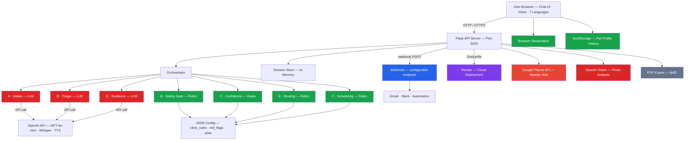
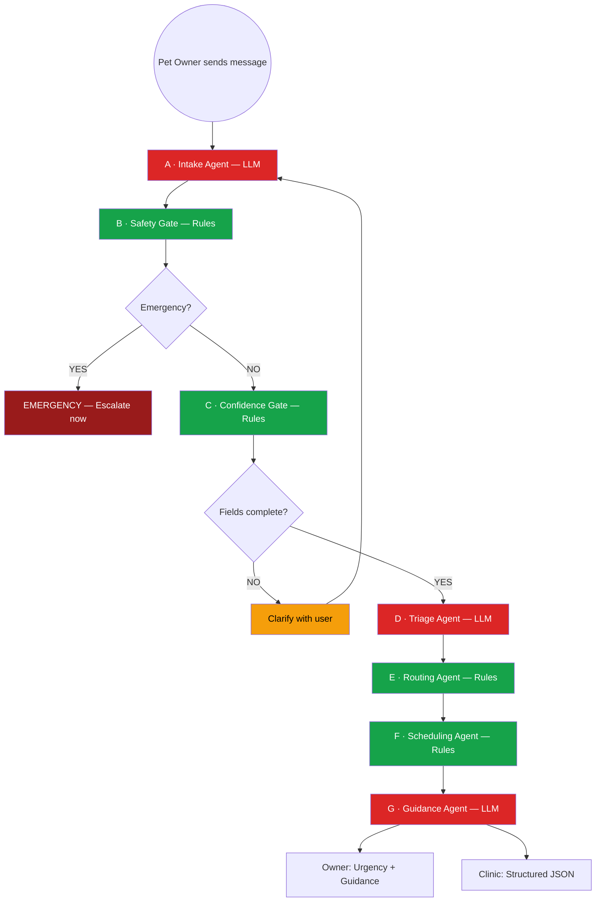
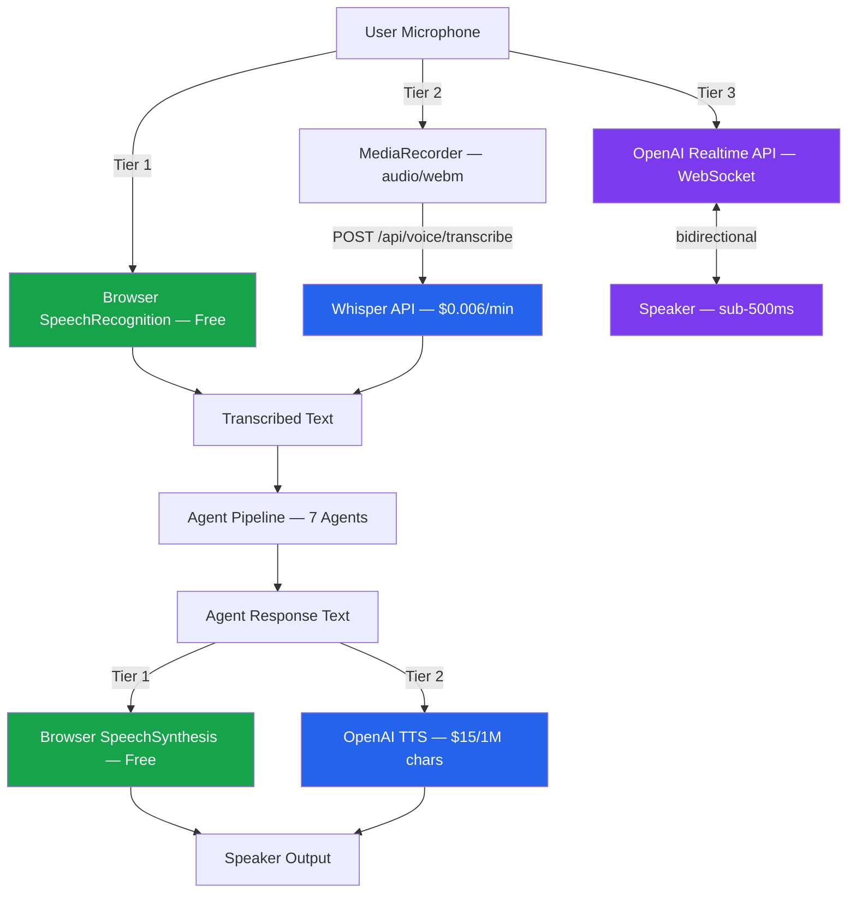

# 🐾 PetCare Agentic System

**Authors:** Syed Ali Turab, Fergie Feng & Diana Liu | **Team:** Broadview
**Date:** March 1, 2026

AI-powered Veterinary Triage & Smart Booking System
A safety-first, multi-agent architecture designed to assist veterinary clinics with structured symptom intake, urgency triage, intelligent routing, and appointment booking — built as part of the MMAI 891 Final Project at Queen's University.

**For pet owners:** Structured intake and clear next steps. **For clinics:** Triage support and structured handoffs — no diagnosis, no bypassing the doctor.

---

## 🚀 Overview

PetCare Agentic System is an AI receptionist framework built to reduce call overload in veterinary clinics by:

- **MVP: text-first** — Structured symptom intake via **chat (text)**; voice is optional/bonus and not required for demo or baseline evaluation (see [BASELINE_METHODOLOGY](docs/BASELINE_METHODOLOGY.md)).
- Collecting structured symptom information via chat (or voice when enabled; 7 languages)
- Safely triaging urgency levels with deterministic red-flag detection
- Routing cases to the correct service line or veterinarian
- Booking appointments intelligently from clinic schedule
- Generating clinic-ready structured summaries (JSON)
- Providing conservative waiting guidance to pet owners
- Triggering post-intake automations via webhook (email, Slack, etc.)
- **Finding nearby veterinary clinics** via Google Maps integration
- **Exporting triage summaries as PDF** for sharing with your vet
- **Analyzing symptom photos** via OpenAI Vision API
- **Remembering pet profiles** across sessions (localStorage)
- **Tracking symptom history** for returning users

The system is designed with **layered responsibility separation**, **safety constraints**, and **extensibility** in mind.

---

## 🎯 Problem Statement

Veterinary clinics often face:

- **High call volumes** — front desk overwhelmed during peak hours
- **Incomplete symptom descriptions** — owners omit critical details
- **Mis-booked appointments** — wrong provider, wrong urgency, wrong slot
- **Repeated clarification calls** — staff calling back to collect missing info
- **Inconsistent triage** — urgency varies by who answers the phone

This system addresses those issues through structured AI-assisted intake and routing with a multi-agent architecture.

---

## 👥 Who It's For (Two Products, One System)

PetCare serves **two audiences** with **one pipeline**: pet owners get a clear intake experience and guidance; clinics get structured triage and handoffs so staff can act quickly. Think of it as two products in how we position value — owners and clinics — powered by the same backend.

### For pet owners

| Aspect | Description |
|--------|-------------|
| **Product** | Structured symptom intake & triage |
| **What you get** | Describe your pet's issue in chat (text or optional voice) → get a **suggested** "how soon to be seen" (Emergency / Same-day / Soon / Routine), **contextual "do/don't while waiting" guidance** (tailored to symptom type from templates; we don't name diseases), and optional **appointment slot options** — without long hold times or repeating yourself. The **final** decision on when to be seen is the **clinic's** (receptionist or doctor); we only suggest based on intake. The system does **not** name conditions or diseases. The AI adds value by **structured intake**, **adaptive follow-ups**, **symptom-dependent suggested triage**, and **symptom-type-specific guidance**. |
| **Safety** | **Not diagnosis.** We never say *what is wrong*. We only suggest *when* to be seen and give general waiting-room advice; the **clinic (receptionist/doctor) makes the real call**. No prescription. When in doubt, we tell you to **seek care** or **talk to the clinic**. Red flags trigger immediate escalation messaging. |

### For clinics

| Aspect | Description |
|--------|-------------|
| **Product** | Intake & triage support for front desk and clinical staff |
| **What you get** | **Fewer incomplete calls**, **consistent intake**, and **structured JSON summaries** with a **suggested** urgency tier and routing so reception and vets can act quickly. The system **suggests** Emergency / Same-day / Soon / Routine for routing; the **receptionist and doctor make the final decision** — receptionist still involves the doctor when needed, same as today. Red-flag detection and handoff to staff when the system isn't confident. |
| **Safety** | The AI **supports** intake and suggests triage; **medical and scheduling decisions stay with receptionists, nurses, and doctors**. The system never diagnoses, prescribes, or bypasses the doctor. Receptionist asks the doctor when in doubt; we don't replace that. Low-confidence or conflicting info routes to human receptionist review. |

One system, two value propositions: better experience for owners, better workflow for clinics.

**Two outputs, one pipeline:**

| Audience | Interface | Output |
|----------|-----------|--------|
| **Pet owner** | One chat interface (web) | Conversational response: suggested urgency, "do/don't while waiting" guidance, optional slot options. |
| **Clinic** | No separate UI for POC | Structured JSON summary delivered via **webhook** (configurable for email, Slack, etc.). |

So: one owner-facing chat with its output; one clinic-facing JSON (same intake) sent through the clinic's chosen channel (email, Slack, webhook).

**Override and verification (required for clinics):**

- **Staff/doctor override:** The clinic must be able to **override** the system's suggested urgency (and routing/slot if needed). If the AI suggests Emergency but staff or the doctor disagrees, they can change it to Same-day / Soon / Routine — and vice versa. The system suggests; staff/doctor decide.
- **Verified before sending to individuals:** The suggested triage and any booking must be **verified** (and optionally overridden) by staff or the doctor **before** the final response or confirmation is sent to the pet owner. So: system produces suggestion + JSON → clinic sees it → staff/doctor verify or override → **then** the owner gets the final message or booking confirmation. No automatic send to the owner without clinic verification in the intended workflow.
- **Emergency = additional charge:** Booking as **Emergency** often incurs an **additional charge**. Override prevents inappropriate emergency labeling (and unnecessary cost to the owner or incorrect resource use). Staff/doctor verify before confirming an emergency appointment.

**How this would be built (with override and verification in place):**

| Phase | What gets built | Owner experience | Clinic experience |
|-------|------------------|------------------|-------------------|
| **POC (current)** | One pipeline: owner chat → 7 agents → owner gets **suggested** response in chat; clinic gets JSON via webhook. Deployed on **Render**. | Sends message → sees suggested urgency + guidance + slots in chat immediately. | Receives JSON summary (suggested tier, routing, summary). Override/verify is **manual** (e.g. staff reads JSON in Slack/email and contacts owner if they disagree). |
| **Production (intended)** | Same pipeline + **clinic verification step** before owner sees final message. | Sends message → may see “We’re reviewing your case” → **after** staff/doctor verify (and optionally override) → owner gets final message or booking confirmation. | Receives JSON in Slack/email → staff/doctor **review, override urgency if needed** (e.g. change Emergency → Same-day) → **approve** → system (or staff) sends final response to owner. Emergency tier clearly flagged (additional charge). |

**Build order:**

1. **Now (POC):** Wire Orchestrator to API → unblock Intake → smoke test → validate scenarios → deploy (e.g. Render). Owner chat shows suggestion; clinic gets JSON. Document that production requires “verify before send” and override.
2. **Clinic side for POC:** Ensure JSON includes `suggested_urgency_tier` (and optionally `is_emergency` for billing). Send to Slack/email so staff can at least see and act manually (call owner, override in their own system).
3. **Later (production):** Add a **verification step**: e.g. a **clinic queue/dashboard** — cases appear in a simple queue, staff override urgency and click “Approve & send to owner,” API updates session and notifies owner. Either way: **no final message to owner until clinic has verified (or overridden) and approved.**

So: build the pipeline and two outputs first (owner chat + clinic JSON); then add the step where clinic verifies/overrides before the owner gets the final say.

---

## 🧠 System Architecture

### System Architecture (Full Stack)



**Color key:** 🔴 Red = LLM/API-powered · 🟢 Green = Client-side (free) · 🔵 Blue = Webhook output · 🟣 Purple = Cloud deployment

---

### 🔄 Agent Pipeline Flow



**Legend:** 🔴 Red = LLM-powered (API call, ~$0.002 each) · 🟢 Green = Rule-based (local, zero cost)

---

### 🎤 Voice Architecture



**Color key:** 🟢 Green = Tier 1 (free, browser-native) · 🔵 Blue = Tier 2 (OpenAI Whisper + TTS) · 🟣 Purple = Tier 3 (Realtime API, stretch)

---

## 🤖 Core Multi-Agent Layer

The PetCare Agent uses a **7-sub-agent architecture** coordinated by a central **Orchestrator Agent**:

| # | Agent | Type | Responsibility |
|---|-------|------|---------------|
| A | **Intake Agent** | 🔴 LLM | Collect pet profile + chief complaint + timeline; ask adaptive follow-ups by symptom area |
| B | **Safety Gate Agent** | 🟢 Rules | Detect emergency red flags → immediate escalation messaging |
| C | **Confidence Gate Agent** | 🟢 Rules | Verify required fields and confidence; route to clarification or receptionist review |
| D | **Triage Agent** | 🔴 LLM | Assign urgency tier (Emergency / Same-day / Soon / Routine) with rationale + confidence |
| E | **Routing Agent** | 🟢 Rules | Classify symptom category → appointment type / provider pool |
| F | **Scheduling Agent** | 🟢 Rules | Propose available slots or generate booking request payload |
| G | **Guidance & Summary Agent** | 🔴 LLM | Generate owner "do/don't" guidance + structured clinic-ready intake summary |

Only 3 of 7 agents make LLM API calls (~$0.01/session). The other 4 run locally as deterministic rules with zero cost.

Agents operate under role-based data permissions to maintain safety boundaries. See [docs/architecture/agents.md](docs/architecture/agents.md) for full I/O contracts and data access policy.

---

## 🗄 Data Layer

| Data Store | Purpose | Used By |
|-----------|---------|---------|
| `backend/data/clinic_rules.json` | Triage rules, routing maps, provider specialties | Triage (D), Routing (E) |
| `backend/data/red_flags.json` | 50+ emergency trigger phrases | Safety Gate (B) |
| `backend/data/available_slots.json` | Mock clinic schedule (30-min slots) | Scheduling (F) |
| In-memory session | Active intake records, appointments | All agents via Orchestrator |

See [docs/architecture/data_model.md](docs/architecture/data_model.md) for full schemas.

---

## 🛡 Safety-First Design Principles

> Core innovation lies in safety-grounded triage and structured routing — not just conversational AI.

This system is **not merely a chatbot**. It is a safety-constrained, rule-grounded, modular multi-agent orchestration framework.

- **No medical diagnosis generation** — never provides diagnoses or prescriptions
- **Deterministic safety layer** — red-flag detection runs as rules before any AI reasoning
- **Rule-grounded urgency classification** — triage maps to clinic-approved rules
- **Red-flag symptom escalation** — 50+ curated emergency triggers with mandatory escalation
- **Structured confirmation** — critical fields verified by Confidence Gate before triage
- **Separation between triage and booking** — urgency classification isolated from scheduling
- **Minimal PII storage** — session-only memory, no persistent owner data
- **Conservative defaults** — when uncertain, escalate rather than under-triage

---

## 🎤 Voice Support

Three tiers of voice interaction for hands-free intake (ideal for pet owners holding a distressed pet):

| Tier | Technology | Cost | Latency | Feel |
|------|-----------|------|---------|------|
| **Tier 1** | Browser Web Speech API | Free | ~100ms | Walkie-talkie |
| **Tier 2** | OpenAI Whisper + TTS | ~$0.02/session | ~1-2s | Walkie-talkie |
| **Tier 3** | OpenAI Realtime API | ~$0.50/session | <500ms | Natural phone call |

Voice is an **opt-in I/O wrapper** — it does NOT alter business logic or agent decisions.

Voice mode requires:
- Critical symptom confirmation via voice
- Noise-handling fallback (text if low confidence)
- Red-flag double confirmation before escalation

See [TECH_STACK.md](TECH_STACK.md) for full voice safety requirements and testing metrics.

---

## 🌐 Multilingual Support

The system supports **7 languages** with full UI translation, RTL support, and multilingual voice:

| Language | Flag | Direction | Voice (STT/TTS) |
|----------|------|-----------|-----------------|
| English | 🇬🇧 | LTR | Full |
| French | 🇫🇷 | LTR | Full |
| Chinese (Mandarin) | 🇨🇳 | LTR | Full |
| Arabic | 🇸🇦 | **RTL** | Full |
| Spanish | 🇪🇸 | LTR | Full |
| Hindi | 🇮🇳 | LTR | Full |
| Urdu | 🇵🇰 | **RTL** | Full |

- Arabic and Urdu automatically flip the layout to right-to-left (RTL)
- Clinic-facing summaries are always generated in English
- Language can be changed mid-conversation
- Set language via URL parameter: `?lang=fr`

---

## 🏷 Technology Stack

| Layer | Technology | Cost |
|-------|-----------|------|
| **Frontend** | HTML5 / CSS3 / JavaScript (ES6+) | Free |
| **Backend** | Python 3.11 + Flask | Free |
| **LLM (Primary)** | OpenAI GPT-4o-mini | ~$0.01/session |

| **Voice STT** | OpenAI Whisper | $0.006/min |
| **Voice TTS** | OpenAI TTS (tts-1) | $15/1M chars |
| **Photo Analysis** | OpenAI Vision (GPT-4o-mini) | ~$0.002/photo |
| **Nearby Vets** | Google Places API | Free tier (up to $200/mo credit) |
| **PDF Export** | fpdf2 (server-side) | Free |
| **Pet Profile & History** | Browser localStorage | Free |

| **Webhook Automation** | Configurable webhook POST (Slack, email, etc.) | Free |
| **Containerization** | Docker + docker-compose | Free |
| **Hosting** | **Render (recommended)** / Railway (free tier) | $0/mo — Render recommended for POC (GitHub auto-deploy, HTTPS). |
| **Languages** | 7 (EN, FR, ZH, AR, ES, HI, UR) | Free |
| **Version Control** | Git + GitHub (`main` branch) | Free |

See [TECH_STACK.md](TECH_STACK.md) for full details, runtime architecture, and agent deployment model.

---

## 📊 Data Sources

### Operational data (used at runtime)

The POC uses only these data files. All are synthetic; no real patient/pet health information (PHI) is used.

| Source | Type | Used by |
|--------|------|---------|
| `backend/data/clinic_rules.json` | Synthetic config | Routing (E): triage rules, routing maps, provider list |
| `backend/data/red_flags.json` | Curated list (50+ entries) | Safety Gate (B): emergency triggers |
| `backend/data/available_slots.json` | Mock data | Scheduling (F): appointment booking POC |

### Design references (not used at runtime)

The following were consulted for domain context and workflow design only. They are **not** loaded or called by the system.

| Source | Type | How we used it |
|--------|------|----------------|
| [HuggingFace: pet-health-symptoms-dataset](https://huggingface.co/datasets/karenwky/pet-health-symptoms-dataset) | Open dataset (2,000 samples) | Symptom taxonomy / category ideas |
| [Vet-AI Symptom Checker](https://www.vet-ai.com/symptomchecker) | Commercial product | Triage workflow design inspiration |
| [SAVSNET / PetBERT](https://github.com/SAVSNET/PetBERT) | Veterinary NLP reference | General NLP / coding patterns |
| [ASPCA Animal Poison Control](https://www.aspcapro.org/antox) | 1M+ cases | Ideas for red-flag phrasing in `red_flags.json` |
| Veterinary emergency textbooks | Clinical reference | Emergency red-flag definitions (curated into `red_flags.json`) |

---

## 🧪 MVP Demo Flow

1. Owner describes symptoms via chat (text, voice, or photo — any of 7 languages)
2. **Intake Agent** asks structured follow-up questions
3. **Safety Gate** checks for emergency red flags
4. **Confidence Gate** verifies data completeness
5. **Triage Agent** classifies urgency tier
6. **Routing Agent** selects appointment type + provider pool
7. **Scheduling Agent** proposes available slots
8. **Guidance Agent** generates owner do/don't guidance + clinic summary
9. Owner can **book an appointment**, **find nearby vets**, **download PDF summary**, or **start over**
10. **Webhook** fires post-intake payload to configurable endpoint (Slack, email, etc.)

---

## ✅ Current Status

> **v1.0-poc — tested and passing.** The 7-agent pipeline is wired end-to-end and passes evaluation with **100% triage accuracy (M2)** and **100% red-flag detection (M4)** across 6 synthetic scenarios, with an average processing time of ~11.4 seconds.

| Area | Status |
|------|--------|
| Architecture & documentation | ✅ Complete |
| Agent Design Canvas & Baseline methodology (see [AGENT_DESIGN_CANVAS](docs/AGENT_DESIGN_CANVAS.md), [BASELINE_METHODOLOGY](docs/BASELINE_METHODOLOGY.md)) | ✅ Documented (Diana) |
| Agent implementations (A–G) | ✅ Implemented & tested |
| Orchestrator | ✅ Implemented & tested |
| Flask API server | ✅ Running (port 5002) |
| Frontend (chat + voice + multilingual + photo) | ✅ Functional |
| Nearby vet finder (Google Places API) | ✅ Implemented |
| PDF triage summary export | ✅ Implemented |
| Photo symptom analysis (OpenAI Vision) | ✅ Implemented |
| Pet profile persistence (localStorage) | ✅ Implemented |
| Symptom history tracker (localStorage) | ✅ Implemented |
| Post-triage appointment booking flow | ✅ Implemented |
| Docker / docker-compose | ✅ Written |
| Webhook automation (optional) | ✅ Implemented; fires only if `N8N_WEBHOOK_URL` set |
| End-to-end integration testing | ✅ Passing (evaluate.py — 6 scenarios) |
| Unit / agent-level testing | 📋 Planned (post-POC) |
| Deployment to cloud (Render) | ✅ Render-ready (Dockerfile tested, deployment guide complete) |

---

## 📋 Next Steps (update as we knock them off)

**Due:** March 22, 2026 · **Target build complete:** March 10–11, 2026 · *Last updated: March 5, 2026*

| # | Step | Status |
|---|------|--------|
| 1 | Wire Orchestrator into API (`api_server.py` → `handle_message()`) | ✅ Done |
| 2 | Unblock Intake so pipeline can complete (set `intake_complete: True` when species + chief complaint present — rule or LLM) | ✅ Done |
| 3 | Smoke test: run backend locally, send one message end-to-end, confirm triage + guidance response | ✅ Done |
| 4 | Validate Scenario 1 (emergency) and Scenario 3 (toxin) — Safety Gate + emergency path | ✅ Done |
| 5 | Validate Scenario 2 (routine skin) and Scenario 4 (ambiguous → clarify) — full pipeline + confidence gate | ✅ Done |
| 6 | Add language to Intake/Triage/Guidance prompts; verify voice (Tier 1/2) | ✅ Done (text); voice Tier 2/3 planned post-POC |
| 7 | Deploy to **Render**; add env vars, confirm live URL | ✅ Done (Dockerfile tested; use [DEPLOYMENT_GUIDE.md](DEPLOYMENT_GUIDE.md)) |
| 8 | Webhook automation (optional; Emergency Alert + Clinic Summary) | ✅ Implemented; optional — fires only if `N8N_WEBHOOK_URL` set |
| 9 | Evaluation: 20+ scenarios, metrics; document 1 strong + 1 failure case | ✅ Done (6 scenarios, 100% M2/M4) |
| 10 | Report + 10–15 min demo video; final README polish | 🔄 In progress |

Full detail: [NEXT_STEPS.md](NEXT_STEPS.md).

---

## 🏗 Development Phases

| Phase | Focus | Status |
|-------|-------|--------|
| **Phase 1** | Core text-based triage (7 agents + orchestrator) | ✅ Complete |
| **Phase 2** | Voice support (3 tiers) + multilingual (7 languages) | ✅ Text multilingual complete; voice Tier 1 complete |
| **Phase 3** | Docker containerization + Render deployment | ✅ Complete |
| **Phase 4** | Webhook automation (optional; actions layer) | ✅ Implemented; optional for POC |
| **Phase 5** | Evaluation & testing | ✅ Complete (100% M2, 100% M4) |
| **Phase 6** | Enhanced UX: nearby vets, PDF export, photo analysis, pet profiles, symptom history | ✅ Complete |
| **Phase 7** | Report, video & polish | 🔄 In progress |

See [PROJECT_PLAN.md](PROJECT_PLAN.md) for full sprint-by-sprint plan with risk register.

---

## 🚀 Quick Start (Docker — Recommended)

Requires only [Git](https://git-scm.com/) and [Docker Desktop](https://www.docker.com/products/docker-desktop/).

### macOS / Linux

```bash
git clone https://github.com/FergieFeng/petcare-agentic-system.git
cd petcare-agentic-system
git checkout main
./start.sh
```

### Windows (PowerShell)

```powershell
git clone https://github.com/FergieFeng/petcare-agentic-system.git
cd petcare-agentic-system
git checkout main
powershell -ExecutionPolicy Bypass -File start.ps1
```

Open [http://localhost:5002](http://localhost:5002) in your browser.

> After someone pushes changes, run the same script again — it pulls and rebuilds automatically. API keys are saved locally.

### Docker Manual Build

```bash
docker build -t petcare-agent .
docker run -p 5002:5002 --env-file .env petcare-agent
```

---

## 🐍 Quick Start (Local Python)

```bash
git clone https://github.com/FergieFeng/petcare-agentic-system.git
cd petcare-agentic-system
git checkout main

python -m venv .venv
source .venv/bin/activate        # macOS/Linux
pip install -r requirements.txt

cp .env.example .env
# Edit .env and add your API keys

cd backend
python api_server.py
```

### Environment Variables

| Variable | Required | Description |
|----------|----------|-------------|
| `OPENAI_API_KEY` | Yes | OpenAI API key for GPT-4o-mini, Whisper, TTS, Vision |
| `GOOGLE_MAPS_API_KEY` | No | Google Maps API key for nearby vet finder (optional) |
| `DEFAULT_LLM_PROVIDER` | No | `openai` (default) |
| `DEFAULT_LLM_MODEL` | No | Model name (default: `gpt-4o-mini`) |
| `PORT` | No | Server port (default: `5002`) |
| `LOG_LEVEL` | No | `DEBUG`, `INFO`, `WARNING`, `ERROR` |
| `N8N_WEBHOOK_URL` | No | Webhook URL for post-intake automation (optional) |

---

## 📁 Project Structure

```
├── frontend/                    # Frontend files
│   ├── index.html               # Main HTML (intake chat UI)
│   ├── js/app.js                # Client-side logic (voice, multilingual)
│   └── styles/main.css          # Styles (RTL support)
├── backend/                     # Backend files
│   ├── api_server.py            # Flask API server
│   ├── orchestrator.py          # Orchestrator (coordinates sub-agents)
│   ├── agents/                  # Sub-agent implementations (A-G)
│   ├── data/                    # Clinic rules, red flags, mock schedule
│   └── logs/                    # Runtime logs
├── docs/                        # Documentation
│   ├── architecture/            # System-level design docs
│   ├── agent_specs/             # Per-agent design work packages (intake, triage, etc.)
│   └── original_main/           # Preserved docs from main branch (Fergie's design)
├── Dockerfile                   # Single-container deployment
├── docker-compose.yml           # Multi-container (optional; includes n8n for local dev)
├── start.sh / start.ps1         # One-click Docker start
├── requirements.txt             # Python dependencies
├── PROJECT_PLAN.md              # Project plan and timeline
├── TECH_STACK.md                # Full technology stack
├── DEPLOYMENT_GUIDE.md          # Step-by-step deployment
├── technical_report.md          # MMAI 891 report template
└── .env.example                 # Environment variable template
```

---

## 📈 Success Metrics (MVP)

| Metric | Target |
|--------|--------|
| Triage tier agreement with clinic staff | ≥ 80% |
| Routing accuracy (correct appointment type) | ≥ 80% |
| Intake completeness (required fields captured) | ≥ 90% |
| Receptionist intake time reduction | 30%+ |
| Re-booking / mis-booking reduction | 20%+ |
| Red flag detection rate | 100% |

---

## 📌 Design Philosophy

> Core innovation lies in safety-grounded triage and structured routing — not just conversational AI.

The system is built to be:

- **Modular** — agents can be extended or replaced independently
- **Extensible** — voice, telephony, and new agents added without altering triage core
- **Safety-aligned** — deterministic safety layer + conservative defaults
- **Clinically practical** — structured outputs for real clinic workflows

---

## 📄 Documentation

| Document | Description |
|----------|-------------|
| [docs/AGENT_DESIGN_CANVAS.md](docs/AGENT_DESIGN_CANVAS.md) | **Agent Design Canvas** (author: Diana Liu) — STEP 1–5, Mermaid workflow, problem → success criteria |
| [TECH_STACK.md](TECH_STACK.md) | Full technology stack, runtime architecture, how agents are deployed |
| [DEPLOYMENT_GUIDE.md](DEPLOYMENT_GUIDE.md) | Step-by-step deployment (local Python, Docker, Render, Railway) |
| [docs/architecture/system_overview.md](docs/architecture/system_overview.md) | Overall architecture and design rationale |
| [docs/architecture/agents.md](docs/architecture/agents.md) | Agent responsibilities, I/O contracts, data access policy, design decisions |
| [docs/architecture/orchestrator.md](docs/architecture/orchestrator.md) | Orchestration logic, rules, and decision ownership |
| [docs/architecture/data_model.md](docs/architecture/data_model.md) | Data schemas, field specs, access policy, privacy guidance |
| [docs/architecture/repo_structure.md](docs/architecture/repo_structure.md) | Repository layout and design rationale |
| [docs/test_scenarios.md](docs/test_scenarios.md) | 6 end-to-end test scenarios + validation checklist |
| [docs/BASELINE_METHODOLOGY.md](docs/BASELINE_METHODOLOGY.md) | **Baseline evaluation** (author: Diana Liu) — manual receptionist script, M1–M6 metrics, gold labels, results table |
| [docs/CHANGELOG.md](docs/CHANGELOG.md) | Full project changelog |
| [PROJECT_PLAN.md](PROJECT_PLAN.md) | Sprint-by-sprint project plan |
| [NEXT_STEPS.md](NEXT_STEPS.md) | **Build order:** wire API → orchestrator, unblock Intake, smoke test, validate scenarios |
| [technical_report.md](technical_report.md) | Technical report (assignment deliverable) |

---

## 🔮 Future Extensions

- Clinic verification/override step before owner sees final triage
- Real clinic booking API integration (Vet360, PetDesk, etc.)
- Insurance pre-authorization agent
- Follow-up care agent with scheduled check-ins
- Vaccination reminder automation
- Telemedicine integration
- Analytics dashboard for clinic operations
- Formal orchestration (LangGraph — optional post-POC)

---

## 📄 License

Educational / MMAI 891 Final Project — Queen's University

---

## 🤝 Contribution

This project is structured for modular expansion. Contributions should preserve:

- Safety boundaries
- Agent responsibility isolation
- Rule-grounded triage design

---

## Data Sources (detailed)

See the [Data Sources](#-data-sources) section above for the main breakdown. Summary:

- **Operational (used at runtime):** `backend/data/clinic_rules.json`, `red_flags.json`, `available_slots.json` only. All synthetic; no PHI.
- **Design references (not used at runtime):** HuggingFace pet-health-symptoms-dataset, Vet-AI Symptom Checker, SAVSNET/PetBERT, ASPCA, veterinary textbooks — consulted for domain context and for curating the operational files above.

**Deployment:** POC uses **Render** for cloud deployment. Webhook/n8n is **optional** (only fires if `N8N_WEBHOOK_URL` is set).

---

## Current Status

> **v1.0-poc — tested and passing.** See the [Current Status](#-current-status) section above for full details.

---

## Summary

This project demonstrates how a **multi-agent architecture with a central orchestrator** can deliver structured, safe, and explainable decision support for veterinary intake triage and appointment booking, while maintaining clear scope and academic rigor.

Built with safety-first agent architecture by **Team Broadview**.
