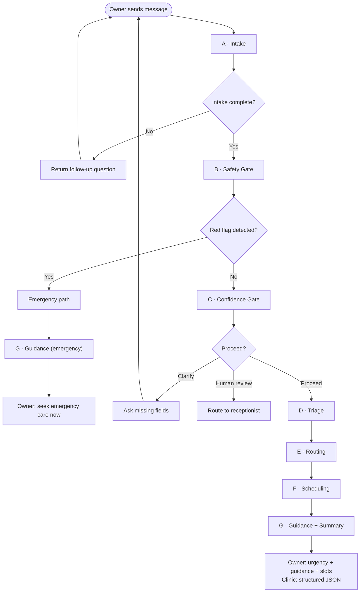

# Agent Design Canvas — PetCare Triage & Smart Booking Agent

**Author:** Diana Liu | **Contributors:** Syed Ali Turab, Fergie Feng | **Team:** Broadview | **Date:** March 1, 2026

This document is the canonical Agent Design Canvas for the PetCare POC, converted to Markdown and updated to reflect the implemented 7-agent architecture, orchestrator, and deployment choices (Flask, Render, voice, multilingual). Original canvas format preserved.

---

## STEP 1: Problem Definition and Agent Justification

### Problem Description

**What specific user task are we solving, improving, or automating?**

Reduce front-desk workload and improve clinical routing by automating pet symptom intake, triage urgency classification, appointment booking support, and vet-facing summary — while providing safe, non-diagnostic “do/don’t” guidance for owners during wait time.

### How is the task done now?

Owners call the clinic; reception staff ask ad-hoc questions, interpret urgency, choose an appointment slot, and manually explain next steps. Intake quality varies by staff experience; peak-time calls create queues; mis-routing (wrong appointment type/doctor/urgency) leads to rescheduling and delays.

### Who is the primary user?

- **Primary:** Clinic receptionist / intake staff (operational user)
- **Secondary:** Pet owners (self-serve intake + scheduling via chat or voice, 7 languages)
- **Downstream:** Veterinarians / vet techs (receive structured intake summary)

### Why does this task require an agent (vs prompting, rules-only, dashboard, classical NLP)?

The workflow is multi-step, branching, and interactive:

- Ask follow-up questions **conditionally** (depends on symptoms and species)
- Identify red flags and **escalate safely** (deterministic Safety Gate before any triage)
- Route case type (e.g. GI, derm, respiratory, injury/pain) and urgency
- Produce **structured handoff summary** for the clinical team

A static prompt is brittle for routing logic and uncertainty handling; rule-based intake alone is too rigid for messy owner descriptions. The design emphasizes an agent as a **structured decision system with escalation rules**, not “a chatbot.”

### What business decision/action/outcome will this agent influence if adopted?

- Faster intake and reduced call burden
- More consistent triage and scheduling accuracy (fewer mis-bookings / rework)
- Better prep for vets (structured case notes before the visit)
- Improved owner experience (clear next steps, less anxiety-driven repeat calls)

### Implementation approach

PetCare is implemented as an **orchestrator agent** that coordinates **seven specialized sub-agents**: Intake (A), Safety Gate (B), Confidence Gate (C), Triage (D), Routing (E), Scheduling (F), Guidance & Summary (G). This modular design improves safety, testability, and reliability, especially for high-stakes triage decisions. Backend: Flask; deployment: **Render** (recommended).

**MVP scope (text-first; voice deferred):** Ship the MVP with **text-based chat first**. Interactive voice is harder to build and test; with limited time, a broken or unstable voice feature would hurt the demo more than help. The assignment rewards a **clean working pipeline with solid test results**, not extra features. Voice can be added as a **bonus** later if capacity allows; do not depend on it for the core demo or baseline comparison. Multilingual (7 languages) is supported for text; voice tiers remain optional/stretch.

---

## STEP 2: Core Workflow Abstraction

### Trigger event

A pet owner initiates intake via **web chat** (or voice-to-text) in one of 7 languages (English, French, Chinese, Arabic, Spanish, Hindi, Urdu). The frontend calls the Flask API; the Orchestrator receives the message and runs the pipeline.

### End-to-end workflow (Mermaid)

### Major processing steps

| Step | Sub-Agent | Responsibility |
|------|-----------|----------------|
| 1 | **A — Intake** | Collect pet profile + chief complaint + timeline; ask adaptive follow-ups by symptom area (GI, respiratory, derm, injury, urinary, neurological, behavioral). |
| 2 | **B — Safety Gate** | Rule-based red-flag detection → immediate escalation messaging; **stop booking flow**. |
| 3 | **C — Confidence Gate** | Verify required fields and confidence; if low → clarify (loop back to Intake, max 2×) or route to receptionist review. |
| 4 | **D — Triage** | Assign urgency tier (Emergency / Same-day / Soon / Routine) with rationale + confidence. |
| 5 | **E — Routing** | Classify symptom category; map to appointment type / provider pool (clinic rule map). |
| 6 | **F — Scheduling** | Propose available slots or generate booking request payload. |
| 7 | **G — Guidance + Summary** | Owner “do/don’t while waiting” + escalation cues; clinic-ready structured intake summary (JSON). |

### Branching conditions / decision rules

- **Emergency escalation** if red flags present (e.g. difficulty breathing, uncontrolled bleeding, suspected toxin ingestion, seizures, collapse, inability to urinate). Pipeline short-circuits to Guidance with emergency-specific output; no triage/routing/booking.
- **Low confidence or missing critical fields** → ask clarifying questions (max 2 loops) or route to receptionist review.
- **Species-specific routing** (cat vs dog vs exotic) → different question sets and provider pool (from `clinic_rules.json`).

### Output format

- **Owner-facing:** Urgency level + what happens next + appointment confirmation/request + safe do/don’t guidance (in session language).
- **Clinic-facing (structured JSON):** Pet profile, symptom timeline, triage tier, red flags, suggested category, confidence score, notes. Always English.

### Autonomy boundaries (act vs escalate)

| The agent **can** | The agent **cannot** |
|-------------------|----------------------|
| Intake, triage tier suggestion, routing suggestion, booking request, safe general guidance, clinic summary | Give a diagnosis; prescribe meds/dosing; override clinic policy; finalize emergency decisions without required escalation messaging |
| **Escalate to human** when confidence is low, red flags appear, or owner responses conflict (e.g. “not breathing” + “acting normal”). | |

---

## STEP 3: Capabilities and Memory Design

### Capabilities needed

| Agent | Capability |
|-------|------------|
| A — Intake | Adaptive questioning + structured extraction (LLM). |
| B — Safety Gate | Rule-based red-flag detection + escalation response (rules + `red_flags.json`). |
| C — Confidence Gate | Required-field validation + uncertainty handling + loop logic (rules). |
| D — Triage | Urgency classification + confidence scoring (LLM + rules). |
| E — Routing | Symptom category → appointment type / provider mapping (rules + `clinic_rules.json`). |
| F — Scheduling | Slot proposal / booking request creation (rules + `available_slots.json`). |
| G — Guidance/Summary | Safe waiting guidance + structured clinic handoff note (LLM). |

### Tools / external systems

**MVP (current):**

- Clinic rulebook (triage + routing) → `backend/data/clinic_rules.json`
- Red-flag list → `backend/data/red_flags.json`
- Mock schedule → `backend/data/available_slots.json`
- Optional: n8n webhooks for post-intake actions (email, Slack, Google Sheets)

**Enhanced features (v1.1-poc):**

- Google Places API → nearby vet finder (real clinics, ratings, phone, directions)
- OpenAI Vision → photo symptom analysis (visual observation, never diagnoses)
- fpdf2 → downloadable PDF triage summary
- Browser localStorage → pet profile persistence and symptom history tracking
- Post-triage appointment booking flow (confirm by name or ordinal)

**Later integrations:**

- Scheduling system API (clinic booking platform)
- CRM/EMR; SMS/email notifications

### Respond under uncertainty

- Show confidence score and “needs review” flag when applicable.
- Ask targeted follow-ups when key info missing (duration, severity, eating/drinking, breathing).
- **Default to safer action:** “contact clinic / emergency” when red flags or ambiguity appear.

### Memory strategy

- **Session-only memory** across sub-agents: `pet_profile`, `symptoms`, `timeline`, `red_flags`, `triage_tier`, `routing`, `booking_request`, `confidence`. Stored in-memory in the Flask API; no persistent DB for POC.
- **No long-term storage** of identifying info by default (privacy-by-design); optional anonymized logs for evaluation.
- Do not store owner identity, phone, or sensitive notes beyond what’s needed for the appointment request.

---

## STEP 4: Data Requirements and Operational Constraints

### Data sources required

- Clinic-defined triage rules + red flags + routing policy → `clinic_rules.json`, `red_flags.json`
- Appointment availability → `available_slots.json` (mock for POC)
- Optional for evaluation: anonymized historical intake notes + outcomes (triage vs actual urgency)

### Who owns data / MVP accessibility

- Clinic operations owns scheduling and intake scripts.
- For MVP, synthetic scenarios + small policy/rule doc (no real PHI/pet-owner data).

### Minimum data quality needed

- Routing rules explicit and versioned (avoid “it depends” policies).
- Availability schedule current (or clearly mock).
- Test scenarios cover common + urgent presentations (see `docs/test_scenarios.md`).

### Update frequency

- Schedule: real-time or daily refresh (production); mock for POC.
- Clinic triage/routing policy: quarterly or as clinic changes staffing/services.

### Operational constraints

- **Latency target:** &lt; 10–15 seconds for full intake summary (intake itself is interactive).
- **Cost control:** Limit LLM calls to Intake (A), Triage (D), Guidance (G); B, C, E, F are rule-based.
- **Safety:** Strict non-diagnostic language + red-flag escalation; logging for audit.
- **Privacy:** Avoid storing sensitive details; minimize retention.
- **Deployment:** Render (recommended) for POC; Docker for local/reproducible runs.

---

## STEP 5: Success Criteria and Failure Analysis

### How to measure success (MVP metrics)

We compare the **agent** against a **manual receptionist phone-script baseline** (same test scenarios). See `docs/BASELINE_METHODOLOGY.md` for the full procedure. Practically, we measure the same four dimensions for both baseline and agent:

| Metric | Baseline (e.g. phone script) | Agent target |
|--------|------------------------------|--------------|
| **Time to complete intake** | e.g. 5 min | e.g. 2 min (target ≥30% reduction) |
| **Required fields captured** | e.g. 70% | **Target >90%** |
| **Triage accuracy** | e.g. inconsistent | **Target >80%** (vs gold labels) |
| **Red-flag detection** | e.g. depends on staff | **Target 100%** (zero missed emergencies) |

**Quality metrics (detail):**

- Triage tier agreement rate with gold labels (target ≥ 80% on test set)
- Routing accuracy to correct appointment type / provider pool (target ≥ 80%)
- Intake completeness — % required fields captured (target ≥ 90%)

**Operational metrics:**

- Reduction in intake time per case vs baseline (target 30%+)
- Reduction in re-bookings / mis-bookings (target 20%+ in pilot)

**Safety:**

- Red-flag detection rate: 100% (zero missed emergencies in test scenarios).

### Potential value (back-of-the-envelope)

Example clinic: 30 calls/day × 5 min intake = 150 min/day. If agent reduces intake by 2 min for half of calls (15 calls): 30 min/day saved ≈ 10 hours/month. At $25/hour admin cost → ~$250/month per clinic, plus softer benefits (better routing, fewer repeat calls).

### Range of uncertainty

Depends on call volume, adoption, and how much scheduling integration exists (large swing if fully integrated vs “draft request”).

### How business impact is validated

Run a 4–6 week pilot: compare average intake time, repeat calls, and re-book rates pre/post; staff survey on intake quality and workload.

### Critical assumptions

- Clinic triage/routing rules can be made explicit enough for an MVP (even if simplified).
- Owners will tolerate structured questions if it’s faster than waiting on hold.

### Three common failure modes

| Failure mode | Description |
|--------------|-------------|
| **Under-triage** | Serious case labeled routine → delayed care. |
| **Over-triage** | Too many cases flagged urgent → overload and loss of trust. |
| **Bad routing** | Wrong appointment type/provider → rescheduling and delay. |

### Mitigations

- **Under-triage:** Conservative red-flag rules + mandatory escalation messaging; Safety Gate runs before triage.
- **Over-triage:** Calibrate thresholds using scenario tests; allow receptionist override; document in report.
- **Bad routing:** Clinic-owned routing map in version control (`clinic_rules.json`); track override reasons and refine rules.

---

## Reference: Key Repo Documents

| Document | Purpose |
|----------|---------|
| [docs/architecture/agents.md](architecture/agents.md) | Sub-agent I/O contracts, data access policy |
| [docs/architecture/orchestrator.md](architecture/orchestrator.md) | Orchestrator responsibilities and branching |
| [docs/test_scenarios.md](test_scenarios.md) | End-to-end test scenarios and validation checklist |
| [NEXT_STEPS.md](../NEXT_STEPS.md) | Build order and due dates (Mar 22, 2026) |

---

End of Agent Design Canvas
