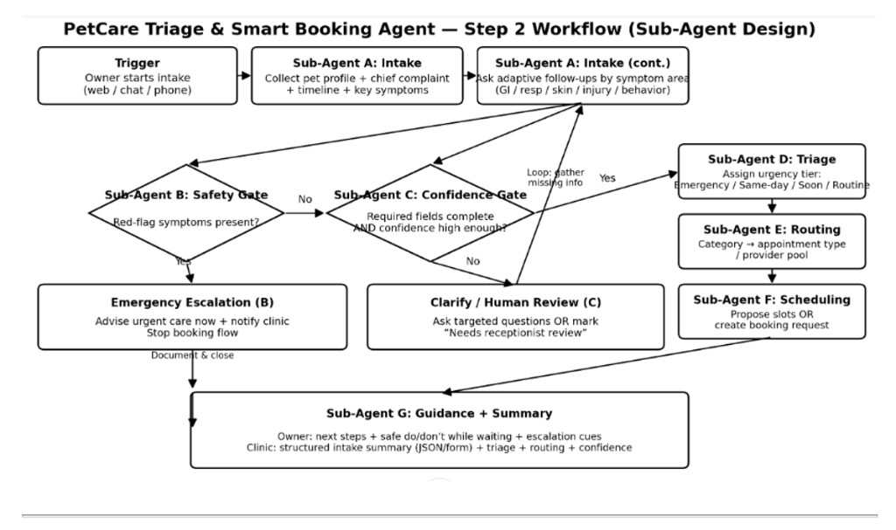

# System Overview

**Authors:** Syed Ali Turab, Fergie Feng & Diana Liu | **Team:** Broadview | **Date:** March 1, 2026

---

## Purpose

The PetCare Triage & Smart Booking Agent automates veterinary clinic intake by collecting pet symptoms, detecting emergencies, classifying urgency, routing to the correct appointment type, and producing structured handoff summaries for the clinical team -- all while providing safe, non-diagnostic guidance to pet owners.

## High-Level Architecture

1. **Input Layer**
   - Accepts owner free-text describing pet symptoms, species, and basic profile via web chat interface.

2. **Intake Layer (Sub-Agent A)**
   - Conducts adaptive, multi-turn symptom collection with species-specific follow-up questions.

3. **Safety Layer (Sub-Agent B)**
   - Rule-based red-flag detection; immediately escalates emergencies.

4. **Validation Layer (Sub-Agent C)**
   - Confidence gate: verifies required fields are captured and signals are coherent.

5. **Analysis Layer (Sub-Agents D + E)**
   - Triage Agent: classifies urgency tier (Emergency / Same-day / Soon / Routine).
   - Routing Agent: maps symptom category to appointment type and provider pool.

6. **Action Layer (Sub-Agent F)**
   - Scheduling Agent: proposes available slots or generates booking request.

7. **Output Layer (Sub-Agent G)**
   - Produces owner-facing guidance ("do/don't while waiting") and clinic-facing structured JSON summary.

8. **Orchestration Layer**
   - Coordinates execution order, manages session state, resolves conflicts, enforces safety rules.

## Architecture Diagram



## Detailed Workflow (Step 2 -- Sub-Agent Design)

The architecture diagram above illustrates the full branching workflow:

### Happy Path (No Red Flags, High Confidence)

```
Trigger (owner starts intake)
  → Sub-Agent A: Intake (collect pet profile + chief complaint + timeline + key symptoms)
  → Sub-Agent A (cont.): Ask adaptive follow-ups by symptom area (GI / resp / skin / injury / behavior)
  → Sub-Agent B: Safety Gate (red-flag symptoms present?)
       → No red flags
  → Sub-Agent C: Confidence Gate (required fields complete AND confidence high enough?)
       → Yes, confidence OK
  → Sub-Agent D: Triage (assign urgency tier: Emergency / Same-day / Soon / Routine)
  → Sub-Agent E: Routing (category → appointment type / provider pool)
  → Sub-Agent F: Scheduling (propose slots OR create booking request)
  → Sub-Agent G: Guidance + Summary (owner do/don't + clinic-facing structured summary)
```

### Emergency Path (Red Flags Detected)

```
Sub-Agent B: Safety Gate → Red-flag symptoms detected
  → Emergency Escalation (B): Advise urgent care now + notify clinic, stop booking flow
  → Document & close
  → Sub-Agent G: Guidance + Summary (emergency-specific guidance + clinic alert)
```

### Clarification Loop (Low Confidence)

```
Sub-Agent C: Confidence Gate → Required fields missing OR confidence too low
  → Clarify / Human Review (C): Ask targeted questions OR mark "needs receptionist review"
  → Loop back to Sub-Agent A: Intake (gather missing info)
  → Re-enter flow at Sub-Agent B: Safety Gate
  (max 2 clarification loops before routing to human)
```

## Technology Stack

| Component | Technology | Notes |
|-----------|-----------|-------|
| **Backend Server** | Python 3.10+ / Flask | Serves API + static frontend |
| **LLM Provider** | OpenAI GPT-4o-mini | Configurable via `.env`; Claude fallback planned post-POC |
| **Agent Framework** | Custom Python Orchestrator | POC: no LangGraph/ADK; keeps flow simple and debuggable. Post-POC: LangGraph optional for formal graph; Google ADK not recommended. |
| **Frontend** | Vanilla HTML / CSS / JavaScript | Chat-based intake UI |
| **Data Contracts** | JSON schemas | Structured I/O between all agents |
| **Containerization** | Docker | Single-container deployment |
| **Deployment** | **Render (recommended)** / Railway | Free-tier cloud; Render is the smart bet for POC (auto-deploy from GitHub, HTTPS, minimal config). |
| **Tracing (optional)** | LangSmith | LLM call observability |

## Data Sources

| Source | What It Provides | Agent(s) Using It |
|--------|-----------------|------------------|
| [HuggingFace pet-health-symptoms-dataset](https://huggingface.co/datasets/karenwky/pet-health-symptoms-dataset) | 2,000 labeled symptom samples (5 conditions) | Reference for symptom taxonomy |
| [ASPCA AnTox / Top Toxins](https://www.aspcapro.org/antox) | Toxin ingestion red flags (1M+ documented cases) | Safety Gate (B) |
| [Vet-AI Symptom Checker](https://www.vet-ai.com/symptomchecker) | Design reference (commercial; 165 vet-written algorithms) | Informed triage workflow design |
| [SAVSNET / PetBERT](https://github.com/SAVSNET/PetBERT) | Veterinary NLP reference (500M+ words, 5.1M records) | Reference for NLP patterns |
| `backend/data/clinic_rules.json` | Clinic routing maps, provider list, species notes | Routing (E) |
| `backend/data/red_flags.json` | 80+ curated emergency triggers | Safety Gate (B) |
| `backend/data/available_slots.json` | Mock clinic schedule | Scheduling (F) |

## Voice Interaction Layer

The system supports three tiers of voice interaction, enabling hands-free intake (ideal for pet owners holding a distressed pet):

| Tier | Technology | Cost | Latency | Best For |
|------|-----------|------|---------|----------|
| **Tier 1** | Browser Web Speech API | Free | ~100ms | Quick POC demo, Chrome/Edge users |
| **Tier 2** | OpenAI Whisper (STT) + TTS | ~$0.02/session | ~1-2s | Consistent quality across all browsers |
| **Tier 3** | OpenAI Realtime API (WebSocket) | ~$0.50-1.00/session | <500ms | Natural voice conversation (stretch goal) |

**Architecture:**
- Tiers 1 & 2 are "voice-to-text + text-to-voice" wrappers around the existing text pipeline — no changes to the agent pipeline
- Tier 3 uses a persistent WebSocket connection for speech-to-speech with sub-500ms latency
- Voice endpoints: `/api/voice/transcribe` (Whisper STT) and `/api/voice/synthesize` (OpenAI TTS)

See [TECH_STACK.md](../../TECH_STACK.md) for full voice tier comparison and implementation details. **MVP:** Baseline evaluation and demo are **text-based**; voice is optional and does not affect the four evaluation metrics.

## Evaluation and baseline comparison

The system is evaluated against a **manual receptionist phone-script baseline** (Option 1 in [BASELINE_METHODOLOGY.md](../BASELINE_METHODOLOGY.md)). The same test scenarios are run through both baseline and agent; the same four metrics are measured:

| Metric | Where it is measured / produced |
|--------|---------------------------------|
| **Time to complete intake** | Session timestamps: `created_at`, first user message time, and state transition to `complete` or `emergency`; pipeline `metadata.processing_time_ms` per request. Evaluator computes wall-clock from first message to intake complete. |
| **Required fields captured** | Confidence Gate (C) output: `missing_required` and `required_fields_captured_pct` (M1). Exposed in `agent_outputs.confidence_gate` and in session summary for scoring. |
| **Triage accuracy** | Triage Agent (D) output: `urgency_tier` in `agent_outputs.triage`. Compared to gold labels per scenario. |
| **Red-flag detection** | Safety Gate (B) output: `red_flag_detected` and `red_flags` in `agent_outputs.safety_gate`. Target 100% on red-flag scenarios. |

Session summary (`GET /api/session/<id>/summary`) and response metadata provide the data needed to fill the baseline-vs-agent results table (M1–M6) for the report and demo.

## Design Characteristics

- **Safety-first:** red-flag detection runs before any routing or scheduling.
- **Composable:** each sub-agent can be swapped or improved independently.
- **Auditable:** every triage decision maps to symptom evidence.
- **Schema-driven:** outputs follow strict validation for clinic integration.
- **Provider-agnostic:** orchestration can call different LLM providers.
- **Text-first MVP:** core pipeline and baseline evaluation are text-based; voice is optional (multi-tier voice available for stretch).

## Architectural Positioning

This system is not merely a chatbot. It is a **safety-constrained, rule-grounded, modular multi-agent orchestration framework** designed for operational veterinary environments.

The primary innovation lies in **structured triage enforcement and routing intelligence** — not conversational novelty. Every design choice prioritizes clinical safety, explainability, and operational reliability over conversational fluency or feature breadth.

Key differentiators from a generic chatbot:

- **Deterministic safety layer** runs before any AI reasoning — red flags trigger escalation regardless of LLM output
- **Mixed execution** — safety-critical agents are rule-based (zero cost, deterministic); only reasoning-heavy agents call the LLM
- **Structured outputs** — every response follows a validated schema; clinic summaries are machine-readable JSON
- **Explicit autonomy boundaries** — the agent never diagnoses, prescribes, or overrides clinic rules
- **Auditable decision chain** — every triage decision traces through the full agent pipeline with evidence

## Non-Goals (POC Phase)

- Providing medical diagnoses or prescriptions
- Integrating with real EMR/CRM systems
- Multi-clinic deployment
- User accounts or persistent profiles
- Payment processing

## Success Criteria

- Triage tier agreement with clinic staff ≥ 80%
- Routing accuracy ≥ 80%
- Intake completeness ≥ 90%
- Full intake flow completes in < 15 seconds (excluding interactive turns)
- Zero missed emergency red flags in test set
