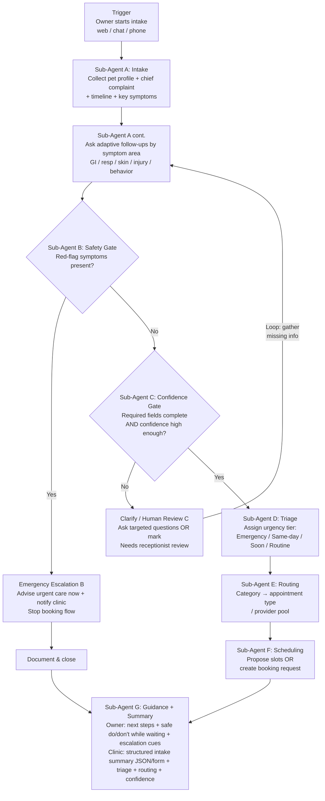

# Technical Workflow (Flowchart + I/O Contracts + Examples)

**Authors:** Syed Ali Turab, Fergie Feng & Diana Liu | **Team:** Broadview | **Date:** March 1, 2026

This is the technical workflow reference for engineers.

For the non-technical version, see `docs/architecture/workflow_non_technical.md`.

---

## 1) End-to-End Flow

1. Owner initiates intake via web chat.
2. **Intake Agent** collects pet profile, chief complaint, and symptom details through adaptive follow-up questions.
3. **Safety Gate** checks for emergency red flags (breathing difficulty, bleeding, toxin ingestion, seizures, collapse).
4. If red flag detected → emergency escalation response → END.
5. **Confidence Gate** validates required fields and assesses data confidence.
6. If low confidence → loop back to Intake for clarifying questions or route to receptionist.
7. **Triage Agent** assigns urgency tier (Emergency / Same-day / Soon / Routine) with rationale.
8. **Routing Agent** classifies symptom category and maps to appointment type / provider pool.
9. **Scheduling Agent** proposes available slots or generates booking request.
10. **Guidance & Summary Agent** produces owner "do/don't" guidance + clinic-ready structured summary.
11. Orchestrator assembles and returns the final response.

---

## 2) Agent-by-Agent Execution

### Step 1: Intake (Required)

**Agent:** Intake Agent (A)

- Collect: species, breed, age, weight, chief complaint, symptom timeline
- Ask adaptive follow-ups based on symptom area
- Output: structured pet profile + symptom data (JSON)

### Step 2: Safety Gate (Required)

**Agent:** Safety Gate Agent (B)

- Check symptoms against emergency red-flag list
- Output: `red_flag_detected` boolean, `escalation_message` if true

### Step 3: Confidence Gate (Required)

**Agent:** Confidence Gate Agent (C)

- Validate required fields, detect conflicts, assess confidence
- Output: confidence score, missing fields, recommended action

### Step 4: Triage (Required)

**Agent:** Triage Agent (D)

- Classify urgency tier with evidence and confidence
- Output: urgency tier, rationale, confidence score

### Step 5: Routing (Required)

**Agent:** Routing Agent (E)

- Map symptom category to appointment type and provider pool
- Output: symptom category, appointment type, provider list

### Step 6: Scheduling (Required for MVP)

**Agent:** Scheduling Agent (F)

- Propose slots based on urgency and appointment type
- Output: proposed slots array or booking request payload

### Step 7: Guidance & Summary (Required)

**Agent:** Guidance & Summary Agent (G)

- Generate safe owner guidance and clinic-ready summary
- Output: owner guidance text + clinic summary JSON

---

## 3) Workflow Flowchart

### Visual Architecture Diagram


### Mermaid Diagram (Interactive)



---

## 4) Input Contract

### Required Input (from owner)

- `species` (string: "dog", "cat", "other")
- `chief_complaint` (string: free-text description of symptoms)

### Collected During Intake (by agent)

- `pet_name` (string)
- `breed` (string)
- `age` (string)
- `weight` (string, with unit)
- `symptom_details` (object: area-specific details)
- `timeline` (string: when symptoms started)
- `eating_drinking` (string: normal / reduced / none)
- `energy_level` (string: normal / reduced / lethargic)
- `additional_notes` (string)

### Example Input (after intake)

```json
{
  "pet_name": "Bella",
  "species": "dog",
  "breed": "Golden Retriever",
  "age": "7 years",
  "weight": "30 kg",
  "chief_complaint": "Vomiting multiple times since yesterday, not eating",
  "symptom_details": {
    "area": "gastrointestinal",
    "vomiting_frequency": "4 times in 24 hours",
    "diarrhea": false,
    "blood_in_vomit": false,
    "foreign_object_possible": "unsure"
  },
  "timeline": "Started yesterday afternoon",
  "eating_drinking": "not eating, drinking small amounts",
  "energy_level": "reduced",
  "additional_notes": "Got into garbage 2 days ago"
}
```

---

## 5) Output Contract

### Owner-Facing Response

- `urgency_level` (string: "Emergency" | "Same-day" | "Soon" | "Routine")
- `next_steps` (string: what happens next)
- `appointment` (object: proposed slot or booking status)
- `guidance` (string: safe do/don't while waiting)

### Clinic-Facing Summary (JSON)

```json
{
  "version": "1.0.0",
  "session_id": "session_2026_03_01_001",
  "pet_profile": {
    "name": "Bella",
    "species": "dog",
    "breed": "Golden Retriever",
    "age": "7 years",
    "weight": "30 kg"
  },
  "chief_complaint": "Vomiting multiple times since yesterday, not eating",
  "symptom_details": {
    "area": "gastrointestinal",
    "vomiting_frequency": "4 times in 24 hours",
    "diarrhea": false,
    "blood_in_vomit": false,
    "foreign_object_possible": "unsure"
  },
  "timeline": "Started yesterday afternoon, possible garbage ingestion 2 days ago",
  "red_flags": [],
  "triage": {
    "urgency_tier": "Same-day",
    "rationale": "Persistent vomiting (4x/24h) with reduced appetite and possible foreign material ingestion. No emergency red flags but warrants same-day evaluation.",
    "confidence": 0.85
  },
  "routing": {
    "symptom_category": "gastrointestinal",
    "appointment_type": "sick_visit_urgent",
    "provider_pool": ["Dr. Chen", "Dr. Patel"],
    "special_requirements": "May need abdominal imaging"
  },
  "scheduling": {
    "proposed_slots": [
      "2026-03-01 14:00",
      "2026-03-01 15:30"
    ],
    "booking_status": "proposed"
  },
  "confidence": {
    "overall": 0.85,
    "intake_completeness": 0.92,
    "needs_review": false
  },
  "metadata": {
    "processing_time_ms": 8200,
    "agents_executed": ["intake", "safety_gate", "confidence_gate", "triage", "routing", "scheduling", "guidance_summary"]
  }
}
```

---

## 6) Notes

- Emergency red flags bypass all agents after Safety Gate and produce an immediate escalation response.
- The Confidence Gate can loop back to Intake up to 2 times before routing to receptionist review.
- All agents must complete within the 15-second latency target (measured end-to-end).
- For canonical field definitions, see `docs/architecture/output_schema.md`.
