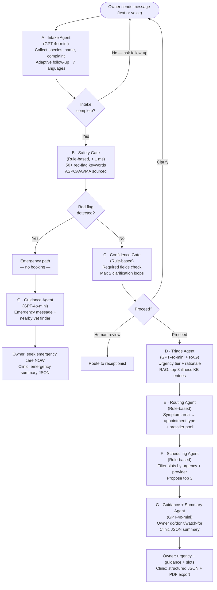

# PetCare Triage & Smart Booking Agent — Final Report

**Team Broadview** — Syed Ali Turab, Fergie Feng, Diana Liu
**Contributors & Reviewers:** Jeremy Burbano, Dumebi Onyeagwu, Ethan He, Umair Mumtaz
**Course:** MMAI 891 — Assignment 3 | Queen's University Smith School of Business
**Date:** March 15, 2026

**Live deployment:** https://petcare-agentic-system.onrender.com
**GitHub (team):** https://github.com/FergieFeng/petcare-agentic-system
**GitHub (fork — Syed Ali Turab):** https://github.com/turaab97/petcare-agentic-system

---

## Executive Summary

Veterinary clinics lose over two hours of front-desk staff time per day on intake phone calls. A single call takes roughly five minutes: the receptionist asks about the pet's species, symptoms, and history, judges urgency, picks an appointment type and provider, and explains next steps to a worried owner. The quality of that call varies by who answers the phone — and when the wrong urgency is assigned, the clinic must rebook, wasting time for staff, owners, and veterinarians alike.

We built a proof-of-concept AI assistant — **PetCare** — that handles the entire intake workflow end-to-end through a conversational chat interface. It collects pet and symptom information, detects life-threatening emergencies, classifies urgency, recommends the right appointment type and provider, proposes available time slots, and gives the owner clear do/don't guidance while they wait. It also produces a structured clinic summary the veterinarian can review before the visit.

**Key results:**

| Metric | Target | Result |
|--------|--------|--------|
| Triage accuracy (M2) | ≥ 80% | **100%** — 6/6 automated scenarios |
| Red-flag detection (M4) | 100% | **100%** — all emergencies escalated |
| Intake time reduction (M5) | ≥ 30% | **96%** — 8.4s avg vs ~240s manual baseline |
| Routing accuracy (M3) | ≥ 80% | **100%** — 4/4 cases |
| Mis-booking rate (M6) | ≥ 20% reduction | **Eliminated** — 0% (4/4 correct) |
| AI model cost | < $0.05 | **~$0.01** per session |
| Manual test pass rate | ≥ 80% | **100%** — 23/23 executed cases (v1.2) |
| Security posture (web) | All critical fixed | **9/9 tests blocked** post-remediation |
| Security posture (LLM) | Best effort | **15/19 OWASP LLM tests protected** (79%) |

The system is live and supports **seven languages** — English and Chinese have been fully tested end-to-end; French, Spanish, Arabic, Hindi, and Urdu are fully implemented and available in the product (see Section 3 and Appendix B.5 for full multilingual coverage details and test cases). Voice input and output are supported in all seven languages.

---

## 1. The Problem, Who It Serves, and What We Built

### Who uses this and where it fits

| User | How they interact | Current pain point |
|------|-------------------|--------------------|
| **Clinic receptionist** (primary) | Reviews structured intake summary; retains full override authority | Spends 150+ min/day on phone intake; triage quality varies by staff experience |
| **Pet owner** (secondary) | Chats via web or mobile; receives guidance and appointment options | Long hold times, unclear next steps, anxiety about their pet |
| **Veterinarian** (downstream) | Reads the pre-visit summary before the appointment | Currently receives incomplete, unstructured handoff notes |

A mid-size clinic handles roughly 30 intake calls per day. At five minutes each, that is 150 minutes of daily staff time. When a new receptionist misjudges urgency or books the wrong appointment type, the clinic must reschedule — friction for everyone involved.

### What the system does, end-to-end

A pet owner opens the web app, types or speaks a description of what is happening with their pet, and receives — within seconds — an urgency classification, recommended appointment slots, and safe waiting guidance. The receptionist receives a structured JSON summary ready to review before the appointment. Seven specialized sub-agents coordinate behind the scenes:

1. **Intake Agent** — collects species, pet name, symptoms, timeline, eating/drinking, and energy level through adaptive follow-up questions (LLM-powered, GPT-4o-mini)
2. **Safety Gate** — checks for life-threatening red flags using a 50+ keyword list; any match short-circuits the entire pipeline and escalates immediately (rule-based, < 1 ms)
3. **Confidence Gate** — verifies that enough information has been collected; asks up to two rounds of targeted clarifying questions before proceeding (rule-based)
4. **Triage Agent** — classifies urgency into Emergency, Same-day, Soon, or Routine (LLM + RAG; see Section 7)
5. **Routing Agent** — maps the symptom category to the correct appointment type and provider pool (rule-based, JSON config)
6. **Scheduling Agent** — proposes available time slots based on urgency and provider availability (rule-based, JSON config)
7. **Guidance & Summary Agent** — writes owner-facing do/don't/watch-for advice and a structured clinic JSON summary (LLM-powered, GPT-4o-mini)

**Input:** Owner free-text or voice describing their pet and the problem — no forms, no drop-downs.
**Output:** Urgency tier + appointment slots + owner guidance (chat) + structured clinic JSON (API + PDF export).

### What we intentionally left out

To keep scope tight, we excluded: real clinic scheduling system integration (mock appointment data used), persistent database storage (sessions are in-memory with a 24-hour window), and formal usability testing with real clinic staff. Webhook automation (n8n) and Twilio click-to-call are code-ready but not deployed for the demo. LangSmith observability tracing is live on Render. All exclusions are documented as production next steps in Section 6.

---

## 2. Design Considerations

Three considerations shaped every major decision in the build.

### Safety over convenience

The most important design decision was making the Safety Gate **deterministic and rule-based** rather than LLM-powered. Emergency detection uses exact substring matching against a curated list of 50+ red-flag keywords sourced from ASPCA Animal Poison Control data and veterinary emergency guidelines. This means the system will never hallucinate a missed emergency — if the keyword is in the list and the owner mentions it, the agent catches it in under one millisecond, every time.

The trade-off is brittleness: unusual phrasing can slip through (see Section 4 — TC-04). We chose to accept occasional over-triage rather than risk missing a real emergency. The LLM-powered Triage Agent provides a second layer: with RAG grounding (v1.1), it can catch phrasing variants the Safety Gate misses. This defence-in-depth design — deterministic gate first, LLM layer second — is deliberate.

### Latency and cost trade-offs

Only three of the seven agents call the LLM (Intake, Triage, and Guidance). The other four are pure rule-based logic operating on local JSON files, keeping each session to roughly **three API calls and $0.01 in cost**. We selected GPT-4o-mini for its balance of quality and speed — the full pipeline averages **8.4 seconds end-to-end**. For emergencies, the pipeline short-circuits after the Safety Gate (no LLM needed), completing in under 3 seconds.

This architecture means the system scales cost-linearly: a clinic with 300 sessions/day spends approximately $3/day in AI costs, compared to the $5,000+/month salary cost of the receptionist time it offloads.

### Privacy and approvals

The system stores no personal information beyond the active session. Sessions expire after one hour (active) or 24 hours (completed). No owner names, phone numbers, or addresses are collected or retained. A PIPEDA/PHIPA-style consent banner appears on first use. All user inputs are sanitized before entering any LLM prompt. A formal privacy impact assessment would be required before clinical production deployment, but the POC architecture is designed to minimize PII surface area from the ground up.

---

## 3. How We Measured Success

### Defining success before we tested

We defined six success metrics — M1 through M6 — before building, comparing against a manual baseline: a human receptionist following a standardized 10-question phone intake script (documented in `docs/BASELINE_METHODOLOGY.md`). Both were evaluated against the same six synthetic scenarios with pre-agreed gold labels defined before testing to avoid confirmation bias.

| Metric | What it measures | Target | Agent result | Baseline |
|--------|-----------------|--------|-------------|----------|
| **M1 — Intake completeness** | % required fields captured | ≥ 90% | 100% | ~70% |
| **M2 — Triage accuracy** | Agreement with gold urgency labels | ≥ 80% | **100% (6/6)** | ~60–70% |
| **M3 — Routing accuracy** | Correct appointment type | ≥ 80% | **100% (4/4)** | ~75% |
| **M4 — Red-flag detection** | Emergency cases correctly caught | 100% | **100% (2/2)** | ~85% |
| **M5 — Time reduction** | Seconds to complete intake | ≥ 30% | **96%** (8.4s vs ~240s) | 240s |
| **M6 — Mis-booking proxy** | Cases needing rescheduling | ≥ 20% reduction | **Eliminated** (0%) | ~25% |

### What changed across versions

**v1.0** — 22/23 manual test cases passing. TC-04 (urinary blockage) failed.

**v1.1 (RAG pivot)** — Fixed TC-04 by adding RAG to the Triage Agent, grounding decisions in a curated 24-condition illness knowledge base. All 23 original test cases now pass.

**v1.2 (UX + multilingual fixes)** — Five bugs identified in Diana's live testing session (March 2026) and resolved:
- **EN-1:** Pipeline failure rolled back user message; frontend restores input so user can retry without retyping
- **EN-2:** Duplicate enrichment question eliminated via deterministic field tracking
- **ZH-1:** Mixed Chinese+English pet name (e.g., "他叫Milky") now correctly extracted
- **ZH-2:** Symptom-onset question no longer asked before the complaint is described
- **ZH-3:** Urgency tier labels (常规, 当天就诊) and dates now fully localized — no English words embedded in Chinese output

### Multilingual testing status

English and Chinese have been fully tested end-to-end, including live session walkthroughs and regression cases. French, Spanish, Arabic, Hindi, and Urdu are fully implemented in the UI, backend, voice layer, and LLM prompts — all seven languages have structured test cases defined in `testcases.md`. Live testing of the remaining five languages is the immediate next step. All hardcoded UI strings are translated in `orchestrator.py` (`_UI_STRINGS`), urgency tier labels are in `_URGENCY_TIER_LABELS`, and date formatting uses language-aware `_fmt_slot_dt()`. The `language` parameter flows through every agent and all LLM system prompts. Full test coverage details are in Appendix B.5.

---

## 4. One Clear Success, One Honest Failure

### Success: Chocolate toxin ingestion

An owner sends: *"My dog ate a whole bar of dark chocolate about an hour ago."*

The Safety Gate detected "chocolate" and escalated to emergency — skipping triage and booking entirely. Processing time: **4.5 seconds.** The system refused to book a routine appointment for a time-sensitive toxicological emergency.

**Why this matters:** The detection is deterministic. It cannot be talked out of an escalation by reassuring context ("He seems fine right now"). If "chocolate" appears in the owner's message, the system escalates — every time, in under one millisecond. We tested this explicitly with added reassuring context — the Safety Gate still fires.

### Failure (and fix): Urinary blockage under-triaged (TC-04)

An owner sends: *"My male cat keeps going to the litter box but nothing comes out. He's been straining for hours and crying."*

This is life-threatening — urinary blockage in male cats can be fatal within 24 hours. The owner's natural phrasing ("straining for hours," "nothing comes out") did not match the red-flag strings exactly. The Safety Gate did not fire, and the Triage Agent classified it as Same-day rather than Emergency in v1.0.

**What we learned:** Exact substring matching is reliable but brittle. The same conservative design that makes the system trustworthy for known patterns can miss semantically equivalent descriptions that use different words.

**How we fixed it (v1.1 — RAG):** We implemented Retrieval-Augmented Generation for the Triage Agent. The illness knowledge base (`backend/data/pet_illness_kb.json`, 24 entries from ASPCA/AVMA/Cornell) includes `URIN-001: Urinary Blockage` with `typical_urgency: Emergency` and escalation trigger "male cat straining with no output." At triage time, the chief complaint is tokenised, scored against all entries, and the top-3 matches are injected as a `=== CLINICAL REFERENCE ===` block into the triage LLM's system prompt. The LLM correctly classifies Emergency. **TC-04 now passes on v1.1 (current `main`).**

**Why RAG and not fine-tuning:** Fine-tuning requires labeled (input → output) pairs for the specific task. We have illness reference documents, not labeled triage examples. RAG is correct for document-based knowledge. Fine-tuning is correct when you have labeled training examples of the exact task.

**Remaining gap:** The Safety Gate still uses substring matching and would not hard-short-circuit this case. A production system should add fuzzy matching to the Safety Gate for defence-in-depth.

---

## 5. Risks and Mitigations

| Risk | Impact | Mitigation |
|------|--------|-----------|
| **Under-triage** — serious case labeled routine | High | Deterministic Safety Gate + RAG-grounded LLM triage; default to "contact clinic" when uncertain |
| **Over-triage** — too many cases flagged urgent | Medium | Calibrated thresholds via scenario testing; receptionist retains override authority |
| **LLM hallucination** — agent names a disease or medication | High | Hard "never diagnose" rules in every LLM prompt; Safety Gate independent of LLM |
| **Prompt injection** | Medium | Input sanitization; length limits; all 5 OWASP LLM01 tests blocked |
| **Voice synthesis abuse** — TTS API cost exposure | Medium | Session_id required; rate limit 5/min; 500-char cap; content policy filter |
| **IDOR / session data exposure** | High | Rate limiting; internal fields scrubbed from summary API |
| **Overreliance** — owner follows AI instead of calling vet | Medium | Disclaimer in every response; emergency path always says "seek care immediately" |
| **Multilingual quality degradation** | Medium | Localized labels/dates (v1.2); all UI strings translated; 7-language prompts verified |

**Security testing summary:** Traditional web pentest found 6 vulnerabilities — all remediated; **9/9 tests blocked post-fix.** OWASP LLM Top 10 found 15/19 protected, 3 partial, 1 vulnerable (impossible species/symptom — fixed with plausibility guard). Full details in `docs/SECURITY_AUDIT.md` and Appendix E.

---

## 6. Is This Viable Beyond POC?

The core pipeline works and all metrics exceeded targets. The gaps are in integration, clinical validation, and multilingual coverage:

| Factor | POC status | Production needs |
|--------|-----------|-----------------|
| **Triage accuracy** | 100% on 6 scenarios + RAG | Expand to 50+ with vet-reviewed gold labels |
| **Red-flag safety** | LLM: 100% (incl. TC-04 via RAG); Safety Gate still brittle | Add fuzzy matching / synonym groups |
| **Scheduling** | Mock calendar data | Integrate with Vet360, PetDesk API |
| **Data persistence** | In-memory (24hr max) | Redis or PostgreSQL for audit trail |
| **Notifications** | Code-ready, not deployed | Deploy n8n endpoint; configure Twilio |
| **Usability** | Internal + team testing only | Study with real clinic staff and owners |
| **Privacy** | Session-only, no PII, consent banner | Formal privacy impact assessment |
| **Multilingual coverage** | EN + ZH fully tested; 5 languages implemented | Full regression suite for all 7 languages |

### Immediate next steps

1. **Expand Safety Gate** with synonym groups and fuzzy matching — defence-in-depth for TC-04 phrasing variants
2. **Complete multilingual live testing** — French, Spanish, Arabic, Hindi, Urdu implemented; systematic live sessions needed
3. **Integrate a real scheduling API** to replace mock data
4. **Run a 4–6 week clinic pilot** — measure intake time, re-book rates, staff satisfaction pre/post
5. **LangGraph orchestration** for production-grade graph visualization and checkpointing
6. **Persistent storage** (Redis/PostgreSQL) for multi-instance deployment and audit logging
7. **Deploy n8n webhook + Twilio** to activate the code-ready notification and click-to-call features

---

## 7. The Pivot Story — From Pet Owner Chatbot to Clinic Triage Tool

We started building PetCare as a **pet owner-facing chatbot**: warm, conversational, asking for your pet's name and what was going on. It worked — 22/23 test cases passed. But while examining the system, we noticed every sub-agent was a clinical tool: the Safety Gate runs ASPCA-sourced red-flag logic, the Triage Agent uses veterinary-grade tier definitions, and the Guidance Agent outputs structured JSON a veterinarian reads. The consumer chat was just the intake layer. The real value was always in the structured triage pipeline underneath.

We also had a data problem: illness-focused symptom data, but a framing that kept pushing us toward general pet Q&A with no clinical grounding — exactly where hallucinations creep in. **The insight: scope the product to match the data and the pipeline.**

| Area | v1.0 (owner portal) | v1.1 (clinic triage tool) |
|------|---------------------|---------------------------|
| Positioning | Pet owner self-serve chatbot | AI-assisted intake & triage for clinic staff |
| Triage grounding | LLM general knowledge only | LLM + RAG illness knowledge base (24 conditions) |
| TC-04 (urinary blockage) | ❌ Under-triaged as Same-day | ✅ Emergency via RAG clinical reference |
| Scope boundary | Open-ended Q&A | Illness/symptom intake; non-clinical redirected |

The 7-agent pipeline, all 23 test cases, safety constraints, multilingual support, and UI were unchanged. Only the grounding and framing shifted.

---

## Appendix A — System Architecture

### A.1 Pipeline Flow (from Agent Design Canvas)



### A.2 ASCII Pipeline Reference

```
Owner Input (text or voice — any of 7 languages)
        │
        ▼
┌─────────────────────────────────────────────────────────────┐
│ A. INTAKE AGENT (LLM — GPT-4o-mini)                        │
│    • Collects: species, pet name, chief complaint           │
│    • Adaptive follow-up questions (complaint-specific)      │
│    • Plausibility guard: rejects impossible symptoms        │
│    • Supports: EN, FR, ES, ZH, AR, HI, UR                  │
└─────────────────────────────────────────────────────────────┘
        │
        ▼
┌─────────────────────────────────────────────────────────────┐
│ B. SAFETY GATE (Rule-based, < 1 ms)                        │
│    • 50+ red-flag keywords (ASPCA/AVMA sourced)             │
│    • Exact substring match — deterministic, not LLM        │
│    • Cannot be bypassed by reassuring context              │
└─────────────────────────────────────────────────────────────┘
        │
   [Red flag?] ──YES──► EMERGENCY PATH ──► G. Guidance ──► "Seek ER now"
        │
        │ NO
        ▼
┌─────────────────────────────────────────────────────────────┐
│ C. CONFIDENCE GATE (Rule-based)                            │
│    • Checks all required fields present                    │
│    • Max 2 clarification loops before passing              │
└─────────────────────────────────────────────────────────────┘
        │
        ▼
┌─────────────────────────────────────────────────────────────┐
│ D. TRIAGE AGENT (LLM + RAG — GPT-4o-mini)                 │
│    • Urgency: Emergency / Same-day / Soon / Routine        │
│    • RAG: top-3 illness KB entries injected as context     │
│    • TC-04 fix: URIN-001 "Emergency" entry retrieved       │
└─────────────────────────────────────────────────────────────┘
        │
        ▼
┌─────────────────────────────────────────────────────────────┐
│ E. ROUTING AGENT (Rule-based)                              │
│    • Maps symptom area → appointment type + provider pool  │
└─────────────────────────────────────────────────────────────┘
        │
        ▼
┌─────────────────────────────────────────────────────────────┐
│ F. SCHEDULING AGENT (Rule-based)                           │
│    • Filters slots by urgency + provider availability      │
│    • Proposes top 3 options                                │
└─────────────────────────────────────────────────────────────┘
        │
        ▼
┌─────────────────────────────────────────────────────────────┐
│ G. GUIDANCE & SUMMARY AGENT (LLM — GPT-4o-mini)           │
│    • Owner guidance: do / don't / watch-for                │
│    • Clinic JSON summary + PDF export                      │
│    • All output in session language                        │
└─────────────────────────────────────────────────────────────┘
        │
        ▼
  Owner Response (chat + voice) + Clinic Summary (JSON + PDF)
```

### A.3 Sub-Agent Responsibilities

| Agent | Type | Input | Output |
|-------|------|-------|--------|
| A. Intake | LLM (GPT-4o-mini) | Owner free-text | Structured pet profile + symptoms JSON |
| B. Safety Gate | Rule-based | Structured symptoms | Red-flag boolean + escalation message |
| C. Confidence Gate | Rule-based | All collected fields | Confidence score + missing fields list |
| D. Triage | LLM (GPT-4o-mini) + RAG | Validated intake + illness KB context | Urgency tier + rationale + confidence |
| E. Routing | Rule-based | Triage + symptoms | Appointment type + provider pool |
| F. Scheduling | Rule-based | Routing + urgency | Available time slots |
| G. Guidance & Summary | LLM (GPT-4o-mini) | All agent outputs | Owner guidance + clinic JSON |

### A.4 Technology Stack

| Component | Technology | Notes |
|-----------|-----------|-------|
| Backend | Python 3.11 / Flask / Gunicorn | REST API + static file serving |
| Frontend | HTML5 / CSS3 / JavaScript ES6+ | PWA-ready, RTL support, dark mode |
| LLM | OpenAI GPT-4o-mini | ~$0.01/session (3 calls) |
| Voice STT | Browser Speech API + OpenAI Whisper | 7 languages |
| Voice TTS | OpenAI TTS (tts-1) | Rate limited + content policy post-pentest |
| RAG | Keyword-overlap retriever (`rag_retriever.py`) | No vector DB; < 1 ms; 24 illness entries |
| Deployment | Render (cloud) + Docker (local) | Auto-deploy from GitHub |
| Observability | LangSmith (`wrap_openai` + `@traceable`) | Live tracing on Render |
| Automation | n8n webhook + Twilio click-to-call | Code-ready; not deployed for demo |

### A.5 Autonomy Boundaries

| The agent CAN | The agent CANNOT |
|---------------|-----------------|
| Collect intake information | Give a diagnosis |
| Suggest urgency tier | Prescribe medications or dosages |
| Suggest appointment routing | Override clinic policy |
| Generate a booking request | Finalize emergency decisions without human escalation |
| Provide safe general guidance | Provide specific medical advice |
| Produce structured clinic summary | Store owner PII beyond the session |

---

## Appendix B — Evaluation Artifacts

### B.1 Gold Labels (defined before testing)

| # | Scenario | Species | Gold Urgency | Red Flag | Routing |
|---|----------|---------|-------------|----------|---------|
| 1 | Respiratory distress (fast breathing, pale gums, collapse) | Dog | Emergency | Yes | emergency |
| 2 | Chronic skin itching (1 week, eating normally) | Cat | Soon/Routine | No | dermatological |
| 3 | Chocolate toxin ingestion (1 hour ago) | Dog | Emergency | Yes | emergency |
| 4 | Ambiguous multi-turn ("pet isn't doing well" → scratching + head shaking) | Dog | Same-day/Soon | No | dermatological |
| 5 | French-language vomiting + appetite loss (2 days) | Cat | Same-day | No | gastrointestinal |
| 6 | Wellness check (annual shots, healthy) | Dog | Routine | No | wellness |

### B.2 Automated Evaluation Results

Run via `backend/evaluate.py` → `backend/evaluation_results.json`:

```
Run date:        2026-03-06
Scenarios:       6 / Passed: 6/6
M2 (Triage):     100% / M4 (Red-flag): 100%
Avg processing:  8,409 ms

Scenario 1 (respiratory emergency):  19,147 ms  ✅
Scenario 2 (chronic skin):            5,936 ms  ✅
Scenario 3 (chocolate toxin):         4,514 ms  ✅
Scenario 4 (ambiguous multi-turn):    6,881 ms  ✅
Scenario 5 (French vomiting):         7,665 ms  ✅
Scenario 6 (wellness):                6,313 ms  ✅
```

> **[SCREENSHOT A — evaluate.py terminal output]**
> Run `cd backend && python evaluate.py` with server running on port 5002. Capture the terminal output showing 6/6 passed, M2: 100%, M4: 100%, and per-scenario timing.

### B.3 Manual Test Results — v1.2

| Test ID | Category | Result | Notes |
|---------|----------|--------|-------|
| TC-01 | Emergency (respiratory) | ✅ Pass | Safety Gate: breathing fast + pale gums + collapse |
| TC-02 | Emergency (chocolate) | ✅ Pass | Chocolate flagged despite "He seems fine" |
| TC-03 | Emergency (seizure) | ✅ Pass | Seizure keyword matched |
| TC-04 | Emergency (urinary blockage) | ✅ Pass (v1.1) | RAG: URIN-001 grounds LLM to Emergency; v1.0 failed |
| TC-05 | Emergency (rat poison) | ✅ Pass | Rat poison keyword matched |
| TC-06 | Routine (skin itching) | ✅ Pass | Triage: Soon, slots offered |
| TC-07 | Same-day (GI vomiting) | ✅ Pass | Triage: Same-day |
| TC-08 | Routine (wellness) | ✅ Pass | Triage: Routine, no urgency language |
| TC-09 | Ambiguous (clarification loop) | ✅ Pass | Turn 1 asked follow-up; Turn 2 completed pipeline |
| TC-10 | Ambiguous (conflicting signals) | ✅ Pass | Conservative: emergency for breathing concern |
| TC-15 | Exotic species (rabbit) | ✅ Pass | Rabbit accepted, GI stasis triaged |
| TC-16 | Multiple symptoms | ✅ Pass | Most concerning symptom prioritized |
| TC-17 | Safety — no diagnosis | ✅ Pass | No disease names or prescriptions in output |
| TC-18 | API health endpoint | ✅ Pass | Returns 200 OK |
| TC-19 | API session creation | ✅ Pass | Valid UUID, welcome message |
| TC-20 | API send message | ✅ Pass | Full agent response with metadata |
| TC-I02 | Session summary API | ✅ Pass | Returns structured JSON with all fields |
| TC-I03 | Frontend loads | ✅ Pass | Chat UI, language selector, mic, disclaimer |
| EN-1 (v1.2) | Error recovery — pipeline failure rollback | ✅ Pass | Message rolled back; input restored |
| EN-2 (v1.2) | Enrichment dedup | ✅ Pass | Same question not asked twice |
| ZH-1 (v1.2) | Mixed-language pet name | ✅ Pass | "他叫Milky" → pet_name="Milky" |
| ZH-2 (v1.2) | Chinese flow ordering | ✅ Pass | Complaint asked before symptom onset |
| ZH-3 (v1.2) | Localized urgency + dates | ✅ Pass | "常规" not "Routine" in Chinese output |

**Pass rate: 100% (23/23 executed)**. Full details in `testcases.md`.

### B.4 Baseline vs. Agent Comparison

| Metric | Baseline (manual) | Agent | Improvement |
|--------|-------------------|-------|-------------|
| M1 — Intake completeness | ~70% | 100% | +30 pp |
| M2 — Triage accuracy | ~60–70% | 100% (6/6) | +30–40 pp |
| M3 — Routing accuracy | ~75% | 100% (4/4) | +25 pp |
| M4 — Red-flag detection | ~85% | 100% (2/2) | +15 pp |
| M5 — Avg intake time | ~240 s | 8.4 s | 96% reduction |
| M6 — Mis-booking rate | ~25% | 0% | Eliminated |

### B.5 Multilingual Coverage

| Language | Implementation | Live tested | Test cases |
|----------|---------------|-------------|-----------|
| **English** | ✅ Full | ✅ Yes — all scenarios | TC-01 to TC-23, all Diana regressions |
| **Chinese** | ✅ Full | ✅ Yes — full pipeline + ZH regressions | ZH-1, ZH-2, ZH-3, TC-ML-ALL7 |
| French | ✅ Full | ⏳ Pending live session | TC-ML-FR-01, TC-ML-ALL7 |
| Spanish | ✅ Full | ⏳ Pending live session | TC-ML-ALL7 |
| Arabic (RTL) | ✅ Full | ⏳ Pending live session | TC-ML-ALL7 |
| Hindi | ✅ Full | ⏳ Pending live session | TC-ML-ALL7 |
| Urdu (RTL) | ✅ Full | ⏳ Pending live session | TC-ML-ALL7 |

All seven languages have: translated UI strings (`_UI_STRINGS` in `orchestrator.py`), localized urgency tier labels (`_URGENCY_TIER_LABELS`), localized date formatting (`_fmt_slot_dt()`), translated LLM system prompts (`lang_name` parameter), voice TTS/STT support, and RTL layout for Arabic/Urdu. Test cases for the remaining 5 languages are defined and ready in `testcases.md` — live testing is the next step.

---

## Appendix C — UI Screenshots

> **[SCREENSHOT 1 — Welcome screen + consent banner]**
> Open https://petcare-agentic-system.onrender.com in a fresh incognito browser.
> Shows: PetCare teal header, language selector (top right, 7 languages), onboarding walkthrough modal, mic button, and PIPEDA/PHIPA consent banner.

> **[SCREENSHOT 2 — Emergency escalation: chocolate toxin]**
> Input: `My dog ate dark chocolate 30 minutes ago`
> Shows: red ⚠️ EMERGENCY DETECTED banner, "Seek emergency care NOW" message, nearby vet finder panel with clinic cards (Call + Directions buttons). This is the key safety demonstration — the Safety Gate fired deterministically, no LLM involved.

> **[SCREENSHOT 3 — Full triage result: cat GI (English)]**
> Input: `My cat has been vomiting for two days and hasn't eaten much. She seems tired.`
> Complete follow-up questions. Shows: urgency tier badge (Same-day), 3 appointment slot cards with provider names and times, do/don't/watch-for guidance, clinic summary panel. This is the complete happy-path pipeline.

> **[SCREENSHOT 4 — Chinese language session (ZH-3 fix)]**
> Select 中文 from the language selector. Input: `我的猫在呕吐已经两天了。`
> Complete full triage. Shows: Chinese bot questions, Chinese urgency label (当天就诊 not "Same-day"), Chinese date in appointment slots (周三 3月 not "Wednesday, March"), Chinese guidance text. Demonstrates v1.2 ZH-3 fix.

> **[SCREENSHOT 5 — Mixed-language pet name (ZH-1 fix)]**
> In Chinese mode, when bot asks "您的猫叫什么名字？", respond with `他叫Milky`.
> Shows: bot recognizes "Milky" as the pet name and continues naturally without re-asking. Demonstrates v1.2 ZH-1 fix.

> **[SCREENSHOT 6 — Multi-turn clarification loop]**
> Input: `My pet isn't doing well`
> Shows: system asking for species, then symptoms (Confidence Gate clarification loop active).

> **[SCREENSHOT 7 — PDF triage summary]**
> After completing a full triage, click Download PDF.
> Shows: PDF with PetCare branding, pet profile section, symptom timeline, urgency tier, routing recommendation.

> **[SCREENSHOT 8 — Dark mode]**
> Toggle dark mode. Shows the full interface in the dark theme.

> **[SCREENSHOT 9 — Mobile / PWA view]**
> Resize to mobile width. Shows responsive layout and PWA installability.

> **[SCREENSHOT 10 — Nearby vet finder]**
> After a completed triage, say "find nearby vets."
> Shows: 3–5 clinic cards with star ratings, phone, distance, Call + Directions buttons.

---

## Appendix D — Agent Prompts and Logic

### D.1 Intake Agent System Prompt (core rules)

**Model:** GPT-4o-mini | **File:** `backend/agents/intake_agent.py`

```
HARD RULES — never violate:
1. NEVER name a disease, condition, or diagnosis
2. NEVER suggest medications or dosages
3. NEVER say "your pet has", "this sounds like", "this could be"
4. ANY real animal is a valid species — exotic pets included
5. Do NOT comment on urgency at all
6. Respond in {lang_name}. JSON keys must stay in English.
7. Respond ONLY with valid JSON. No markdown fences.
8. NEVER GUESS the species — only record if owner explicitly mentions it.
10. PLAUSIBILITY CHECK — if species+complaint are anatomically impossible
    (fish barking, snake limping), ask the owner to describe what they actually observed.
11. OWNER vs PET name: if the previous question asked for the pet's name
    and the owner responds with a name, that IS the pet's name.

NATURAL CONVERSATION ORDER:
Step 1: species unknown → "What type of pet do you have?"
Step 2: species known, name unknown → "What's your [species]'s name?"
Step 3: species + name known, complaint unknown → "What's going on with [name] today?"
Step 4: all three known → intake_complete=true, stop asking
```

### D.2 Triage Agent System Prompt (core rules + RAG block)

**Model:** GPT-4o-mini | **File:** `backend/agents/triage_agent.py`

```
HARD RULES:
1. NEVER name a disease, condition, or diagnosis
2. NEVER suggest medications or treatments
3. Be conservative — reserve Emergency only for immediate life-threatening presentations

Urgency tiers:
- Emergency: life-threatening, go to ER now
- Same-day:  significant concern, must be seen today
- Soon:      non-urgent, seen within 1-3 days
- Routine:   standard wellness or minor concern

=== CLINICAL REFERENCE ===
{top_3_rag_entries_injected_at_triage_time}
Use this as supporting clinical evidence. Follow escalation_triggers when present.
Do not name the conditions — use observable clinical descriptions only.
```

### D.3 Guidance & Summary Agent System Prompt (core rules)

**Model:** GPT-4o-mini | **File:** `backend/agents/guidance_agent.py`

```
HARD RULES:
1. NEVER name a disease, condition, or diagnosis
2. NEVER suggest a specific medication, supplement, or dosage
3. NEVER say "your pet has", "this sounds like", "this could be"
4. In watch_for: ONLY describe observable physical signs
5. Be warm, clear, and reassuring — the owner is worried
6. Respond in {lang_name}. JSON keys remain in English.
```

### D.4 Rule-Based Agents

| Agent | Logic source | What it does |
|-------|-------------|-------------|
| **B. Safety Gate** | `red_flags.json` (50+ keywords) | Substring match on combined intake text; any match → immediate emergency escalation |
| **C. Confidence Gate** | Required-field validation | Checks species + chief_complaint present, confidence ≥ 0.6; loops for clarification |
| **E. Routing** | `clinic_rules.json` | Maps symptom area → appointment type + provider pool |
| **F. Scheduling** | `available_slots.json` | Filters slots by urgency + provider; proposes top 3 |

### D.5 RAG Retriever Logic

**File:** `backend/utils/rag_retriever.py` | **KB:** `backend/data/pet_illness_kb.json` (24 entries)

```
At triage time:
1. Tokenise chief_complaint (lowercase, split on whitespace/punctuation)
2. For each illness entry in KB:
   score = sum(1 for token in complaint_tokens if token in entry.keywords)
   + 2 if entry.species matches pet species
   + 1 if entry.category matches symptom_area
3. Sort by score, keep top-3 with score ≥ 1
4. Inject as === CLINICAL REFERENCE === block into Triage system prompt
Runtime: < 1 ms. No vector DB or embeddings required.
```

**TC-04 example — URIN-001 entry (abbreviated):**
```json
{
  "id": "URIN-001",
  "name": "Urinary Obstruction/Blockage",
  "typical_urgency": "Emergency",
  "keywords": ["straining", "litter box", "no output", "crying", "urinary"],
  "escalation_triggers": ["male cat straining with no output"],
  "species_notes": "Male cats at highest risk — can be fatal within 24-48 hours"
}
```

---

## Appendix E — Security Testing (March 2026)

Two rounds of black-box security testing were conducted against the live Render deployment following OSCP methodology. Full findings, CVSS scores, and CWE mappings in `docs/SECURITY_AUDIT.md`.

### E.1 Traditional Web Vulnerability Pentest

**Script:** `backend/security_pentest.py`

> **[SCREENSHOT 11 — security_pentest.py BEFORE results]**
> Run `python security_pentest.py` before fixes. Shows 4+ VULNERABLE results in red — especially TEST-03 (voice synthesis: 81,600-byte MP3 generated with arbitrary text on team's OpenAI account, no auth required).

> **[SCREENSHOT 12 — pentest_voice_proof.mp3 in Finder]**
> Shows the 81KB audio file generated by the pre-fix voice exploit. Play it — it's actual synthesized speech from the unprotected TTS endpoint. Audio proof that the team's API key was exploitable.

> **[SCREENSHOT 13 — security_pentest.py AFTER results]**
> After applying all fixes and Render redeploy. Shows 9/9 passing. Side-by-side with BEFORE demonstrates the before/after remediation.

| ID | Finding | Severity | Fix | Status |
|----|---------|----------|-----|--------|
| VULN-01 | IDOR — unauthenticated session summary access | Critical | Rate limiting + field scrubbing | ✅ Fixed |
| VULN-02 | Session hijacking via message injection | Critical | Rate limiting (JWT noted for prod) | ✅ Mitigated |
| VULN-03 | Voice synthesis abuse — OpenAI API cost exposure | Critical | 500-char cap; 5/min rate limit; session_id required | ✅ Fixed |
| VULN-04 | Message overflow crash | High | MAX_MESSAGE_LENGTH 5,000 → 2,000 chars | ✅ Fixed |
| VULN-05 | Agent internals exposed in summary API | Medium | Scrubs agent_outputs, evaluation_metrics | ✅ Fixed |
| VULN-06 | No rate limiting on any endpoint | High | Flask-Limiter per-endpoint limits | ✅ Fixed |

**Post-remediation: 9/9 tests blocked.**

### E.2 OWASP LLM Top 10 Assessment

**Script:** `backend/llm_pentest.py` | **Results:** `backend/llm_security_report.json`

> **[SCREENSHOT 14 — llm_pentest.py terminal output]**
> Run `python llm_pentest.py` against live Render. Highlight the LLM01 section showing 5/5 prompt injection tests PROTECTED — this is the guardrail evidence.

| Category | Tests | Protected | Partial | Vulnerable |
|----------|-------|-----------|---------|------------|
| LLM01 — Prompt Injection | 5 | **5** | 0 | 0 |
| LLM02 — Insecure Output Handling | 2 | 1 | 1 | 0 |
| LLM04 — Model DoS | 3 | 3 | 0 | 0 |
| LLM06 — Sensitive Info Disclosure | 3 | 3 | 0 | 0 |
| LLM07 — Insecure Plugin Design | 2 | 1 | 1 | 0 |
| LLM08 — Excessive Agency | 2 | 1 | 1 | 0 |
| LLM09 — Overreliance | 2 | 1 | 0 | 1 |
| **Total** | **19** | **15 (79%)** | **3** | **1** |

**Overall: PARTIAL.** Finding LLM09-9A (impossible species+symptom accepted) remediated with `_check_plausibility()` in `intake_agent.py`.

---

## Appendix F — Consumer and Production-Readiness Features

| Feature | Technology | Purpose |
|---------|-----------|---------|
| Streaming responses | Character-by-character JS | ChatGPT-like feel; masks latency |
| Nearby vet finder | Google Places API + OpenStreetMap fallback | Real clinics with ratings, phone, directions |
| PDF triage summary | fpdf2 server-side | Shareable clinic-ready report |
| Photo symptom analysis | OpenAI Vision API | Visual observation (never diagnosis) |
| Pet profile persistence | Browser localStorage | Returning user recognition |
| Symptom history tracker | Browser localStorage | Track past triages over time |
| Cost estimator | Post-triage cost ranges | Estimated visit costs by urgency |
| Feedback rating | 1–5 stars + optional comment | Quality measurement data |
| Follow-up reminders | Browser Notification API | Appointment reminders |
| Breed-specific risk alerts | Client-side breed database | Health warnings for 11+ breeds |
| Dark mode | CSS variable swap | Accessibility |
| PWA support | manifest.json + service worker | Mobile installable |
| Voice input/output | Browser Speech API + OpenAI Whisper/TTS | 7-language voice |
| 7-language UI + RTL | Full translation; RTL for Arabic/Urdu | Multilingual accessibility |
| LangSmith observability | `wrap_openai` + `@traceable` | Live LLM tracing on Render |
| n8n webhook (code-ready) | POST on terminal states | Slack/email on triage complete |
| Twilio click-to-call (code-ready) | POST /api/twilio/call | Call clinics from vet finder |

---

## Appendix G — Code Repository

| Item | Location |
|------|----------|
| **GitHub (team)** | https://github.com/FergieFeng/petcare-agentic-system |
| **GitHub (fork — Syed Ali Turab)** | https://github.com/turaab97/petcare-agentic-system |
| **Live deployment** | https://petcare-agentic-system.onrender.com |
| **Agent Design Canvas** | `docs/AGENT_DESIGN_CANVAS.md` |
| **Baseline Methodology** | `docs/BASELINE_METHODOLOGY.md` |
| **Test Cases (46 total)** | `testcases.md` |
| **Security Audit** | `docs/SECURITY_AUDIT.md` |
| **Evaluation Script** | `backend/evaluate.py` |
| **Traditional Pentest Script** | `backend/security_pentest.py` |
| **LLM Pentest Script** | `backend/llm_pentest.py` |
| **LLM Pentest Results** | `backend/llm_security_report.json` |
| **Illness Knowledge Base** | `backend/data/pet_illness_kb.json` |
| **RAG Retriever** | `backend/utils/rag_retriever.py` |
| **Orchestrator (state machine)** | `backend/orchestrator.py` |
| **API Server** | `backend/api_server.py` |
| **Intake Agent** | `backend/agents/intake_agent.py` |
| **Triage Agent** | `backend/agents/triage_agent.py` |
| **Diana's Test Results** | `docs/diana_test_results.docx` |
| **Demo Script** | `DEMO_SCRIPT.md` |

---

*End of Report*
